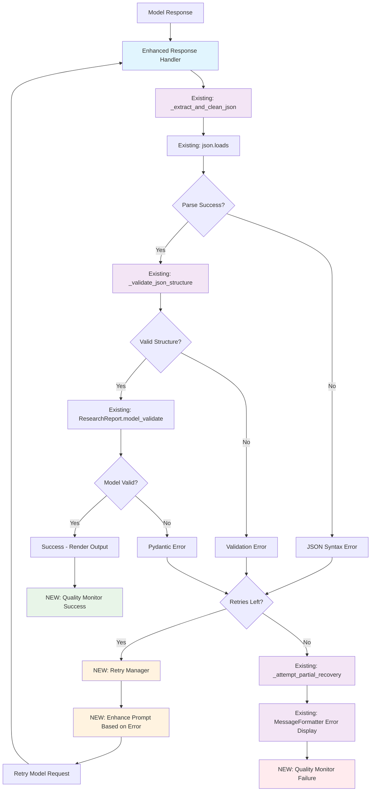

# Design Document: Graceful Model Response Handling

## Overview

The AI Research Assistant system already has a sophisticated error handling foundation in `orchestrator.py` with comprehensive JSON extraction, validation, and partial recovery mechanisms. However, the current implementation lacks retry strategies, configurable recovery options, and systematic quality monitoring. This design refines and extends the existing error handling architecture rather than replacing it.

The system will evolve from the current single-attempt processing to a multi-layered approach that adds retry mechanisms, enhanced recovery strategies, and configurable behavior while preserving the existing robust validation and user-friendly error messaging.

## Architecture

### Refined Architecture



### Refined Component Architecture

The system preserves all existing components while adding minimal new functionality:

1. **Enhanced Response Handler** - Lightweight wrapper around existing `run_research_helper`
2. **Existing Validation & Recovery** - Preserve all current `_validate_json_structure` and `_attempt_partial_recovery` logic
3. **New Retry Manager** - Add retry capabilities with enhanced prompts
4. **New Quality Monitor** - Add optional monitoring without changing behavior
5. **Existing Message Formatter** - Preserve all current user-friendly error messages

## Components and Interfaces

### Enhanced Response Handler (Refactored)

The existing `run_research_helper` function will be refactored to use a new `EnhancedResponseHandler` that wraps the current validation and recovery logic with retry capabilities and quality monitoring.

```python
class EnhancedResponseHandler:
    """Enhanced wrapper around existing response processing with retry capabilities."""
    
    def __init__(self, config: ResponseHandlerConfig):
        self.retry_manager = RetryManager(config.retry_config)
        self.quality_monitor = QualityMonitor()
        self.config = config
        
    async def process_response_with_retries(
        self, 
        analysis_agent: Agent,
        prompt: str,
        context: RequestContext
    ) -> ProcessingResult:
        """Process response with retry logic around existing validation."""
        
        for attempt in range(self.retry_manager.max_retries + 1):
            try:
                # Use existing agent execution
                result = await analysis_agent.run(prompt)
                raw_output = result.output
                
                # Use existing extraction and validation
                clean_json = _extract_and_clean_json(raw_output)
                parsed = json.loads(clean_json)
                validation_result = _validate_json_structure(parsed)
                
                if validation_result.is_valid:
                    # Success path - use existing ResearchReport validation
                    report = ResearchReport.model_validate(parsed)
                    self.quality_monitor.record_success(context)
                    return ProcessingResult(success=True, data=report, processing_path=ProcessingPath.DIRECT_SUCCESS)
                else:
                    # Use existing partial recovery if this is the last attempt
                    if attempt == self.retry_manager.max_retries:
                        _attempt_partial_recovery(raw_output, clean_json, parsed)
                        return ProcessingResult(success=False, processing_path=ProcessingPath.COMPLETE_FAILURE)
                    
                    # Enhance prompt for retry
                    prompt = self.retry_manager.enhance_prompt(prompt, validation_result.error_type, raw_output)
                    
            except json.JSONDecodeError as e:
                if attempt == self.retry_manager.max_retries:
                    # Use existing error handling
                    print(MessageFormatter.json_syntax_error(str(e), e.lineno, e.colno))
                    return ProcessingResult(success=False, processing_path=ProcessingPath.COMPLETE_FAILURE)
                
                # Enhance prompt for syntax retry
                prompt = self.retry_manager.enhance_prompt_for_syntax_error(prompt, str(e))
                
            except Exception as e:
                # Use existing error handling for final attempt
                if attempt == self.retry_manager.max_retries:
                    print(MessageFormatter.parsing_error(str(e)))
                    return ProcessingResult(success=False, processing_path=ProcessingPath.COMPLETE_FAILURE)
                
                # Generic retry enhancement
                prompt = self.retry_manager.enhance_prompt_generic(prompt, str(e))
        
        return ProcessingResult(success=False, processing_path=ProcessingPath.COMPLETE_FAILURE)
```

**Key Responsibilities:**
- Wrap existing validation and recovery logic with retry capabilities
- Enhance prompts based on specific error types from existing validation
- Preserve all existing error messaging and user experience
- Add quality monitoring without changing core processing

### Enhanced Validation (Extension)

The existing `_validate_json_structure` function already provides comprehensive validation. We'll extend it with additional error classification for retry strategies.

```python
def _classify_error_for_retry(validation_result: ValidationResult) -> RetryStrategy:
    """Classify validation errors to determine optimal retry strategy.
    
    Extends existing validation with retry-specific classification.
    """
    if validation_result.error_type == "syntax":
        return RetryStrategy.SYNTAX_EMPHASIS
    elif validation_result.error_type == "schema":
        return RetryStrategy.SCHEMA_EXAMPLE
    elif validation_result.error_type == "field_type":
        return RetryStrategy.TYPE_CLARIFICATION
    elif validation_result.error_type == "structure":
        return RetryStrategy.FORMAT_INSTRUCTION
    else:
        return RetryStrategy.GENERIC_CLARIFICATION

class ValidationResult:
    """Extended validation result with retry classification."""
    is_valid: bool
    error_message: str = ""
    error_type: str = ""
    show_raw_response: bool = True
    retry_strategy: Optional[RetryStrategy] = None  # New field
```

**Extensions to Existing System:**
- Add retry strategy classification to existing validation results
- Preserve all existing validation logic and error messages
- Extend error types with retry-specific information
- Maintain backward compatibility with current validation flow

### Enhanced Recovery (Extension)

The existing `_attempt_partial_recovery` function already provides good partial data extraction. We'll extend it with additional recovery techniques and make it more systematic.

```python
def _enhanced_partial_recovery(
    raw_output: str, 
    cleaned_output: str, 
    parsed_data: dict = None,
    recovery_config: RecoveryConfig = None
) -> RecoveryResult:
    """Enhanced version of existing partial recovery with additional techniques.
    
    Extends the current _attempt_partial_recovery with:
    - Systematic recovery result tracking
    - Additional extraction patterns
    - Configurable recovery methods
    """
    recovery_result = RecoveryResult()
    
    # Use existing recovery logic as base
    try:
        # Call existing partial recovery function
        _attempt_partial_recovery(raw_output, cleaned_output, parsed_data)
        
        # Add enhanced recovery techniques
        if recovery_config and recovery_config.enable_enhanced_extraction:
            # Try additional pattern matching for paper data
            enhanced_data = _extract_with_enhanced_patterns(raw_output)
            if enhanced_data:
                recovery_result.recovered_data = enhanced_data
                recovery_result.success = True
                recovery_result.recovery_method = RecoveryMethod.ENHANCED_PATTERNS
        
        return recovery_result
        
    except Exception as e:
        recovery_result.success = False
        recovery_result.error_message = str(e)
        return recovery_result

def _extract_with_enhanced_patterns(text: str) -> Optional[dict]:
    """Additional extraction patterns beyond existing recovery."""
    # Enhanced patterns for paper extraction from conversational text
    patterns = {
        'title_patterns': [
            r'(?:title|paper):\s*"([^"]+)"',
            r'(?:title|paper):\s*([^\n]+)',
            r'"title":\s*"([^"]+)"'
        ],
        'author_patterns': [
            r'(?:author|by):\s*"([^"]+)"',
            r'(?:author|by):\s*([^\n]+)',
        ]
    }
    
    # Implementation would extend existing extraction logic
    pass
```

**Extensions to Existing System:**
- Wrap existing `_attempt_partial_recovery` with enhanced result tracking
- Add configurable recovery methods while preserving existing behavior
- Extend pattern matching beyond current capabilities
- Maintain all existing user messaging and output formatting

### New Retry Manager

This is the main new component that adds retry capabilities to the existing system without disrupting current functionality.

```python
class RetryManager:
    """Progressive retry mechanism that enhances prompts based on error analysis."""
    
    def __init__(self, config: RetryConfig):
        self.max_retries = config.max_retries
        self.timeout_config = config.timeout_config
        
    def enhance_prompt(
        self, 
        original_prompt: str, 
        error_type: str,
        previous_response: str
    ) -> str:
        """Enhance prompt based on specific error type from existing validation."""
        
        if error_type == "syntax":
            return self._add_syntax_emphasis(original_prompt)
        elif error_type == "schema":
            return self._add_schema_example(original_prompt)
        elif error_type == "field_type":
            return self._add_type_clarification(original_prompt)
        elif error_type == "structure":
            return self._add_format_instruction(original_prompt)
        else:
            return self._add_generic_clarification(original_prompt)
    
    def _add_syntax_emphasis(self, prompt: str) -> str:
        """Add JSON syntax emphasis to prompt."""
        syntax_instruction = (
            "\n\nIMPORTANT: Respond with ONLY valid JSON. "
            "Ensure proper commas, brackets, and quotes. "
            "Do not include any text before or after the JSON object."
        )
        return prompt + syntax_instruction
    
    def _add_schema_example(self, prompt: str) -> str:
        """Add schema example to prompt."""
        schema_example = (
            '\n\nRequired JSON format:\n'
            '{\n'
            '  "query": "user query string",\n'
            '  "papers": [\n'
            '    {\n'
            '      "title": "paper title",\n'
            '      "year": 2023,\n'
            '      "venue": "venue name",\n'
            '      "url": "paper url",\n'
            '      "doi": "paper doi",\n'
            '      "key_points": ["point 1", "point 2"],\n'
            '      "why_relevant": ["reason 1", "reason 2"]\n'
            '    }\n'
            '  ]\n'
            '}'
        )
        return prompt + schema_example

class RetryConfig:
    max_retries: int = 3
    base_delay: float = 1.0
    max_delay: float = 10.0
    timeout_per_attempt: float = 30.0
    enabled_for_errors: Set[str] = {"syntax", "schema", "field_type", "structure"}
```

**Integration with Existing System:**
- Uses existing error types from `_validate_json_structure`
- Enhances prompts based on specific validation failures
- Preserves all existing error handling when retries are exhausted
- Configurable retry behavior that can be disabled to maintain current behavior

### New Quality Monitor

This component adds monitoring capabilities without changing existing processing logic.

```python
class QualityMonitor:
    """Monitor response quality patterns without changing existing processing."""
    
    def __init__(self, config: QualityConfig = None):
        self.config = config or QualityConfig()
        self.metrics = ResponseMetrics()
        
    def record_success(self, context: RequestContext) -> None:
        """Record successful response processing."""
        self.metrics.total_attempts += 1
        self.metrics.successful_attempts += 1
        self.metrics.success_by_model[context.model_name] += 1
        
    def record_failure(self, context: RequestContext, error_type: str, recovery_attempted: bool) -> None:
        """Record failed response processing."""
        self.metrics.total_attempts += 1
        self.metrics.failed_attempts += 1
        self.metrics.failures_by_type[error_type] += 1
        self.metrics.failures_by_model[context.model_name] += 1
        
        if recovery_attempted:
            self.metrics.recovery_attempts += 1
    
    def record_retry(self, context: RequestContext, attempt_number: int, error_type: str) -> None:
        """Record retry attempt."""
        self.metrics.retry_attempts += 1
        self.metrics.retries_by_error_type[error_type] += 1
        
    def get_quality_report(self) -> QualityReport:
        """Generate quality report for monitoring."""
        success_rate = self.metrics.successful_attempts / max(self.metrics.total_attempts, 1)
        return QualityReport(
            success_rate=success_rate,
            total_attempts=self.metrics.total_attempts,
            failure_breakdown=dict(self.metrics.failures_by_type),
            model_performance=dict(self.metrics.success_by_model)
        )

@dataclass
class ResponseMetrics:
    total_attempts: int = 0
    successful_attempts: int = 0
    failed_attempts: int = 0
    retry_attempts: int = 0
    recovery_attempts: int = 0
    content_quality_issues: int = 0
    failures_by_type: dict = field(default_factory=lambda: defaultdict(int))
    failures_by_model: dict = field(default_factory=lambda: defaultdict(int))
    success_by_model: dict = field(default_factory=lambda: defaultdict(int))
    retries_by_error_type: dict = field(default_factory=lambda: defaultdict(int))
    content_issues_by_type: dict = field(default_factory=lambda: defaultdict(int))
```

**Integration Approach:**
- Add monitoring calls to existing error handling paths
- Collect metrics without changing user-facing behavior
- Track both technical parsing issues and content quality issues
- Optional reporting that doesn't interfere with current functionality
- Configurable monitoring that can be disabled

### New Result Enhancement Engine

This component handles intelligent enhancement of insufficient or poor-quality results.

```python
class ResultEnhancementEngine:
    """Enhance insufficient results through intelligent retry strategies."""
    
    def __init__(self, config: EnhancementConfig):
        self.config = config
        self.query_enhancer = QueryEnhancer()
        self.prompt_optimizer = PromptOptimizer()
        
    async def enhance_insufficient_results(
        self,
        original_report: ResearchReport,
        content_issues: List[ContentIssue],
        analysis_agent: Agent,
        original_prompt: str
    ) -> EnhancementResult:
        """Attempt to enhance results based on content quality issues."""
        
        enhancement_attempts = []
        
        for issue in content_issues:
            if issue.type == ContentIssueType.EMPTY_RESULTS:
                # Try broader search terms
                enhanced_prompt = self.query_enhancer.broaden_query(original_prompt)
                enhancement_attempts.append(
                    EnhancementAttempt(
                        strategy=EnhancementStrategy.BROADER_QUERY,
                        enhanced_prompt=enhanced_prompt,
                        reason="Expanding search terms to find more papers"
                    )
                )
                
            elif issue.type == ContentIssueType.INSUFFICIENT_RESULTS:
                # Try query expansion
                enhanced_prompt = self.query_enhancer.expand_query(original_prompt)
                enhancement_attempts.append(
                    EnhancementAttempt(
                        strategy=EnhancementStrategy.QUERY_EXPANSION,
                        enhanced_prompt=enhanced_prompt,
                        reason="Adding related terms to find more relevant papers"
                    )
                )
                
            elif issue.type == ContentIssueType.INCOMPLETE_ANALYSIS:
                # Request more detailed analysis
                enhanced_prompt = self.prompt_optimizer.add_analysis_emphasis(original_prompt)
                enhancement_attempts.append(
                    EnhancementAttempt(
                        strategy=EnhancementStrategy.DETAILED_ANALYSIS,
                        enhanced_prompt=enhanced_prompt,
                        reason="Requesting more complete paper analysis"
                    )
                )
        
        # Execute enhancement attempts (limited to prevent loops)
        best_result = original_report
        for attempt in enhancement_attempts[:self.config.max_enhancement_attempts]:
            try:
                enhanced_result = await analysis_agent.run(attempt.enhanced_prompt)
                # Process and validate enhanced result
                # Keep the best result based on quality metrics
                pass
            except Exception:
                continue
        
        return EnhancementResult(
            success=len(enhancement_attempts) > 0,
            enhanced_report=best_result,
            attempts_made=enhancement_attempts
        )

class EnhancementStrategy(Enum):
    BROADER_QUERY = "broader_query"
    QUERY_EXPANSION = "query_expansion"
    DETAILED_ANALYSIS = "detailed_analysis"
    RELEVANCE_FOCUS = "relevance_focus"
```

## Data Models

### Core Data Structures

```python
@dataclass
class ProcessingResult:
    """Result of complete response processing."""
    success: bool
    data: Optional[dict]
    processing_path: ProcessingPath
    quality_score: float
    warnings: List[str]
    debug_info: Optional[DebugInfo]

@dataclass
class RequestContext:
    """Context information for request processing."""
    user_query: str
    model_name: str
    attempt_count: int
    previous_errors: List[ErrorType]
    timestamp: datetime
    session_id: str

@dataclass
class ErrorClassification:
    """Detailed error classification."""
    primary_type: ErrorType
    secondary_types: List[ErrorType]
    severity: ErrorSeverity
    location: Optional[ErrorLocation]
    suggested_recovery: RecoveryMethod
    user_message: str

class ErrorType(Enum):
    SYNTAX_ERROR = "syntax_error"
    SCHEMA_VALIDATION = "schema_validation"
    MISSING_FIELDS = "missing_fields"
    WRONG_TYPES = "wrong_types"
    EXTRACTION_FAILURE = "extraction_failure"
    NETWORK_ERROR = "network_error"
    TIMEOUT_ERROR = "timeout_error"
    UNKNOWN_ERROR = "unknown_error"

class ProcessingPath(Enum):
    DIRECT_SUCCESS = "direct_success"
    RECOVERY_SUCCESS = "recovery_success"
    RETRY_SUCCESS = "retry_success"
    FALLBACK_SUCCESS = "fallback_success"
    COMPLETE_FAILURE = "complete_failure"
```

### Configuration Models

```python
@dataclass
class ResponseHandlerConfig:
    """Configuration for response handler behavior."""
    retry_config: RetryConfig
    recovery_config: RecoveryConfig
    fallback_config: FallbackConfig
    quality_config: QualityConfig
    debug_mode: bool = False

@dataclass
class RecoveryConfig:
    """Configuration for recovery strategies."""
    enable_syntax_repair: bool = True
    enable_partial_extraction: bool = True
    enable_type_coercion: bool = True
    enable_pattern_matching: bool = True
    min_confidence_threshold: float = 0.6

@dataclass
class QualityConfig:
    """Configuration for quality monitoring."""
    enable_monitoring: bool = True
    failure_threshold: float = 0.3
    alert_on_degradation: bool = True
    track_model_patterns: bool = True
```

## Testing Strategy

### Dual Testing Approach

The testing strategy employs both unit tests for specific scenarios and property-based tests for comprehensive coverage across the wide input space of malformed responses.

**Unit Testing Focus:**
- Specific error scenarios and edge cases
- Integration between components
- Configuration validation
- User interface behavior
- Network error handling

**Property-Based Testing Focus:**
- Universal properties that hold across all valid inputs
- Comprehensive coverage of malformed response patterns
- Recovery mechanism effectiveness
- System stability under various failure conditions

### Property-Based Testing Configuration

- **Minimum 100 iterations** per property test due to randomization
- Each property test references its design document property
- **Tag format**: `Feature: graceful-model-response-handling, Property {number}: {property_text}`

The system is well-suited for property-based testing because:
- Response processing involves pure functions with clear input/output behavior
- There are universal properties that should hold across a wide range of malformed inputs
- The input space (various malformed JSON patterns) is large and benefits from randomized testing
- Recovery mechanisms should work consistently across different error patterns

## Error Handling

### Error Classification System

The system implements a comprehensive error classification that enables targeted recovery strategies:

```python
class ErrorClassifier:
    """Classify errors for targeted recovery."""
    
    def classify_error(
        self, 
        validation_result: ValidationResult
    ) -> ErrorClassification:
        """Classify error with detailed context."""
        
    def _determine_severity(self, error_type: ErrorType) -> ErrorSeverity:
        """Determine error severity for prioritization."""
        
    def _suggest_recovery_method(self, error_type: ErrorType) -> RecoveryMethod:
        """Suggest appropriate recovery method."""
```

**Error Categories:**
1. **Recoverable Errors** - Can be fixed through automated recovery
2. **Retry-able Errors** - May succeed with improved prompts
3. **Fallback Errors** - Require alternative processing methods
4. **Fatal Errors** - Cannot be recovered, require user intervention

### Graceful Degradation Strategy

The system implements multiple levels of graceful degradation:

1. **Level 1: Direct Processing** - Standard validation and processing
2. **Level 2: Recovery Processing** - Automated error recovery
3. **Level 3: Retry Processing** - Enhanced prompts and retry attempts
4. **Level 4: Fallback Processing** - Alternative data extraction
5. **Level 5: Minimal Processing** - Basic error reporting with helpful guidance

Each level maintains system functionality while providing progressively simpler responses.

### User Communication Strategy

```python
class UserCommunicator:
    """Handle user-friendly error communication."""
    
    def format_error_message(
        self, 
        error_classification: ErrorClassification,
        processing_result: ProcessingResult
    ) -> str:
        """Format user-friendly error message."""
        
    def suggest_user_actions(self, error_type: ErrorType) -> List[str]:
        """Suggest specific user actions."""
        
    def format_partial_success(
        self, 
        recovered_data: dict, 
        warnings: List[str]
    ) -> str:
        """Format partial recovery success message."""
```

**Communication Principles:**
- Never expose technical implementation details
- Provide specific, actionable guidance
- Clearly indicate what was recovered vs. what failed
- Maintain consistent tone and formatting
- Include debug information only when explicitly enabled

## Correctness Properties

*A property is a characteristic or behavior that should hold true across all valid executions of a system-essentially, a formal statement about what the system should do. Properties serve as the bridge between human-readable specifications and machine-verifiable correctness guarantees.*

After analyzing all acceptance criteria, I identified several areas where properties can be consolidated to eliminate redundancy while maintaining comprehensive coverage:

**Property Reflection:**
- Properties 1.1-1.4 can be combined into a comprehensive validation pipeline property
- Properties 2.1-2.5 can be consolidated into recovery mechanism effectiveness properties  
- Properties 3.1-3.5 can be unified into retry management behavior properties
- Properties 5.1-5.5 can be combined into user interface behavior properties
- Properties 7.1-7.5 can be consolidated into configuration compliance properties
- Properties 8.1-8.4 can be unified into model adaptation properties
- Properties 9.1-9.4 can be combined into graceful degradation properties

### Property 1: Validation Pipeline Correctness

*For any* model response, the validation engine should correctly classify it as valid or invalid, preserve the original response, classify any errors by type, and trigger appropriate recovery strategies based on the error classification.

**Validates: Requirements 1.1, 1.2, 1.3, 1.4**

### Property 2: Recovery Mechanism Effectiveness

*For any* malformed response with recoverable errors (syntax errors, missing fields, type mismatches, embedded JSON), the recovery strategy should attempt appropriate recovery techniques and validate any recovered data before proceeding.

**Validates: Requirements 2.1, 2.2, 2.3, 2.4, 2.5**

### Property 3: Retry Management Behavior

*For any* parsing failure, the retry manager should attempt the configured number of retries with enhanced prompts specific to the error type, and trigger fallback mechanisms when maximum retries are reached.

**Validates: Requirements 3.1, 3.2, 3.3, 3.4, 3.5**

### Property 4: Fallback Processing Completeness

*For any* response that fails recovery and retry attempts, the fallback mechanism should attempt text processing to extract available information and present it with clear indicators of completeness or incompleteness.

**Validates: Requirements 4.1, 4.2, 4.3, 4.4**

### Property 5: User Interface Communication Standards

*For any* error or partial recovery scenario, the user interface should display user-friendly messages without exposing technical details, provide specific user action recommendations, and show technical details only in debug mode when enabled.

**Validates: Requirements 5.1, 5.2, 5.3, 5.4, 5.5**

### Property 6: Quality Monitoring Completeness

*For any* response processing attempt, the system should log the attempt with appropriate details, track failure patterns across multiple dimensions, maintain recovery and retry metrics, and trigger alerts when quality thresholds are exceeded.

**Validates: Requirements 6.1, 6.2, 6.3, 6.4, 6.5**

### Property 7: Configuration Compliance

*For any* configuration setting (retry limits, timeouts, recovery methods, fallback modes), the response handler should respect the configured values instead of defaults and apply them consistently across all processing scenarios.

**Validates: Requirements 7.1, 7.2, 7.3, 7.4, 7.5**

### Property 8: Model Adaptation Flexibility

*For any* model type or response format, the response handler should detect model-specific patterns, apply appropriate preprocessing for known quirks, support multiple schema formats, and maintain backward compatibility with existing formats.

**Validates: Requirements 8.1, 8.2, 8.3, 8.4**

### Property 9: Graceful Degradation Guarantee

*For any* system stress or consistent failure scenario, the response handler should adapt processing modes, provide basic functionality through fallbacks, never crash or become unresponsive, and communicate degradation status to users with alternatives.

**Validates: Requirements 9.1, 9.2, 9.3, 9.4**

### Property 10: JSON Processing Round-Trip Integrity

*For any* valid JSON object, the parsing and pretty-printing pipeline should preserve data integrity through round-trip operations, handle various formatting styles, support incremental parsing for large responses, and provide detailed error location information for parsing failures.

**Validates: Requirements 10.1, 10.2, 10.3, 10.4, 10.5**

### Property 11: Content Quality Assessment

*For any* successfully parsed research report, the content quality validator should detect empty results, insufficient papers, incomplete analysis, and relevance issues, providing appropriate user guidance and enhancement suggestions for each content quality scenario.

**Validates: Requirements 11.1, 11.2, 11.3, 11.4, 11.5**

### Property 12: Intelligent Result Enhancement

*For any* content quality issue detected, the result enhancement engine should attempt appropriate enhancement strategies (broader queries, detailed analysis requests, relevance focus) while limiting attempts to prevent infinite loops and preserving the best available results.

**Validates: Requirements 12.1, 12.2, 12.3, 12.4, 12.5**

### Property 13: Adaptive Query Guidance

*For any* poor-quality result scenario (empty, sparse, irrelevant), the system should provide specific, actionable query improvement suggestions based on the type of issue detected and explain why the suggestions might yield better results.

**Validates: Requirements 13.1, 13.2, 13.3, 13.4, 13.5**

### Property 14: Partial Result Optimization

*For any* research report with mixed quality papers (some complete, some incomplete), the system should prioritize complete information, clearly indicate data completeness levels, and present partial results with appropriate reliability indicators.

**Validates: Requirements 14.1, 14.2, 14.3, 14.4, 14.5**

This design provides a comprehensive, extensible foundation for graceful model response handling that addresses both technical parsing errors and content quality issues. The system transforms error-prone interactions into reliable, user-friendly experiences while maintaining system robustness and providing valuable diagnostic information for continuous improvement.