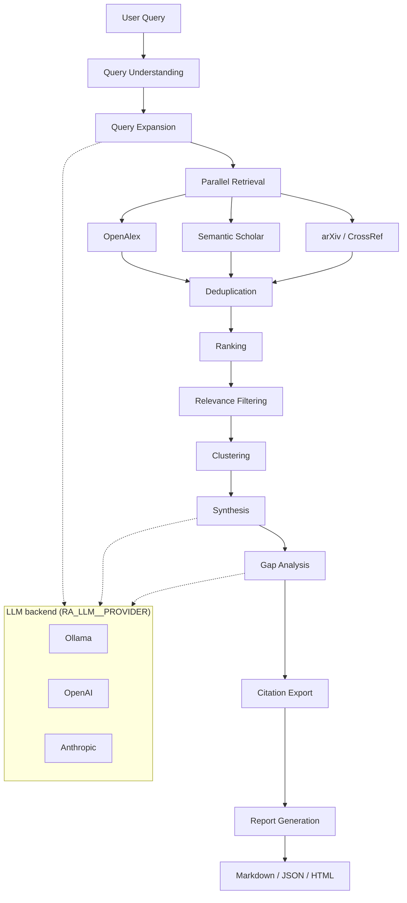

# AI Research Assistant

A local-first research pipeline that retrieves academic papers from multiple scholarly APIs, ranks and clusters them with embeddings, synthesizes cross-paper insights, and exports reports in several formats. Uses **Ollama** by default for fully local LLM inference, with optional **OpenAI** and **Anthropic** providers.

Built with Python 3.13, pydantic-ai, sentence-transformers, and async I/O.

**Documentation:** [https://ndevu12.github.io/Research_Assistant_Model/](https://ndevu12.github.io/Research_Assistant_Model/) — architecture, configuration, API reference, and operations.

## Features

- **Multi-stage pipeline** — query understanding → expansion → retrieval → deduplication → ranking → relevance filtering → clustering → synthesis → gap analysis → citation export → report generation
- **Local-first LLM** — Ollama with resource-aware model auto-selection; OpenAI and Anthropic supported via the same provider abstraction
- **Multi-source retrieval** — OpenAlex, Semantic Scholar, arXiv, and CrossRef with per-provider retry, rate-limit handling, and graceful degradation
- **Embedding-backed analysis** — sentence-transformers (`bge-small-en-v1.5`) for deduplication, ranking, and HDBSCAN clustering
- **Report output** — Markdown, JSON, HTML, and print-ready PDF (HTML), plus BibTeX/APA/MLA/Chicago citation export
- **Session memory** — optional SQLite-backed interactive sessions with retrieval caching

## Requirements

- Python 3.13+ and [Pipenv](https://pipenv.pypa.io/)
- Internet access for paper retrieval (LLM inference can run fully offline after model download)

| Local model | RAM | Disk |
|-------------|-----|------|
| `llama3.2:3b` | 4–6 GB | ~2.5 GB |
| `llama3.1:8b` | 8–10 GB | ~5 GB |

Cloud providers require only an API key — no Ollama install.

## Quick start

```bash
pip install pipenv
pipenv install
cp .env.example .env          # optional; edit as needed
pipenv run python -m src "transformer attention mechanisms"
```

On first run with the default Ollama provider, the assistant checks dependencies, installs and starts Ollama if needed, pulls the resolved model, and then runs the pipeline. Always run through Pipenv (`pipenv run python -m src`) so all dependencies are available.

## Usage

```bash
# Interactive mode with session follow-ups
pipenv run python -m src

# Single query (markdown to stdout)
pipenv run python -m src "your research query"

# HTML report saved to file
pipenv run python -m src --format html -o reports/report.html "your query"

# Print-ready PDF (open in browser → Print → Save as PDF)
pipenv run python -m src --format pdf -o reports/report.pdf.html "your query"

# JSON output with citation exports
pipenv run python -m src --format json --export bibtex,apa "your query"
```

| Flag | Description |
|------|-------------|
| `--format` | `markdown` (default), `json`, `html`, `pdf` |
| `--export` | Comma-separated citation formats: `bibtex`, `apa`, `mla`, `chicago` |
| `--output`, `-o` | Write the report to a file |
| `--session` | Enable SQLite session memory in batch mode |
| `--no-progress` | Disable live progress streaming on stderr |
| `--verbose`, `-v` | Show INFO-level logs on the console (full detail is always in `logs/`) |

On an interactive terminal, reports render with formatted headings, bullets, and syntax-highlighted JSON; piped or redirected output stays plain text, so `python -m src "query" > report.md` works unchanged.

Setup and health checks can also be run directly — see [setups/README.md](setups/README.md):

```bash
pipenv run python -m setups.health_check
pipenv run python -m setups.manager [--model llama3.1:8b]
```

## Configuration

Configuration is layered (highest precedence first): shell environment variables (`RA_*`, nested with `__`) → `.env` file → YAML files in `config/` → code defaults.

Common settings:

| Variable | Default | Description |
|----------|---------|-------------|
| `RA_LLM__PROVIDER` | `ollama` | `ollama`, `openai`, or `anthropic` |
| `RA_LLM__MODEL` | `auto` | Model name, or `auto` for resource-based selection (Ollama) |
| `RA_LLM__API_KEY` | — | Unified API key (or `OPENAI_API_KEY` / `ANTHROPIC_API_KEY`) |
| `RA_LLM__BASE_URL` | provider-specific | Custom endpoint (e.g. LM Studio) |
| `RA_SYNTHESIS__LLM_ENABLED` | `false` | Enable LLM-based synthesis and gap analysis |
| `RA_RANKING__TOP_K` | `25` | Papers kept after ranking |
| `RA_PIPELINE__STREAM_PROGRESS` | `true` | Live stage/LLM progress on stderr |
| `RA_PIPELINE__DEBUG` | `false` | Verbose pipeline logging |
| `RA_SKIP_SETUP_CHECK` | — | Skip the Ollama setup/health check on startup |
| `RA_CONSOLE_LOG_LEVEL` | `WARNING` | Log level shown on the console (files always get full detail) |
| `S2_API_KEY` | — | Semantic Scholar API key (higher rate limits) |
| `RA_CROSSREF_MAILTO` | — | Email for the CrossRef polite pool |

Cloud provider example:

```bash
RA_LLM__PROVIDER=openai        # or anthropic
RA_LLM__MODEL=gpt-4o-mini      # or a claude-* model
OPENAI_API_KEY=sk-...          # or ANTHROPIC_API_KEY
RA_SYNTHESIS__LLM_ENABLED=true
```

The full configuration reference (all `RA_*` variables, YAML files, ranking weights, provider toggles) is in the [documentation](https://ndevu12.github.io/Research_Assistant_Model/).

## Architecture



Every stage degrades gracefully: retrieval continues when a provider fails, ranking falls back to keyword signals without embeddings, and synthesis/gap analysis use heuristics when the LLM is disabled or unavailable.

```
Research_Assistant_Model/
├── config/          # YAML configuration (merged at runtime)
├── src/
│   ├── __main__.py  # CLI entry point (python -m src)
│   ├── config/      # Settings, model auto-selection
│   ├── core/        # Pipeline engine, stage recovery, metrics
│   ├── retrieval/   # Providers, deduplication, retrieval stage
│   ├── research/    # Query expansion, ranking, relevance, clustering
│   ├── analysis/    # Synthesis, gap analysis
│   ├── embeddings/  # sentence-transformers + disk cache
│   ├── models/      # LLM providers (Ollama, OpenAI, Anthropic)
│   ├── reporting/   # Markdown, HTML, JSON renderers
│   ├── export/      # BibTeX, APA, MLA, Chicago
│   ├── memory/      # SQLite session store
│   └── utils/       # Logging, retry, response handling
├── setups/          # Install and health-check scripts
├── tests/           # Test suite (pytest)
└── docs/            # mkdocs documentation site
```

## Development

```bash
pipenv install --dev
pipenv run pytest              # run the test suite
ruff check src tests setups    # lint
```

Within the package use relative imports (`from .models import RetrievedPaper`); from external scripts use absolute imports (`from src.retrieval.orchestrator import run_research_helper`).

| Core dependency | Role |
|-----------------|------|
| `pydantic-ai` | LLM agents with structured outputs |
| `aiohttp` | Async HTTP for scholarly APIs |
| `sentence-transformers` | Embeddings for dedup, ranking, clustering |
| `pydantic` / `pydantic-settings` | Schemas and configuration |
| `hdbscan` | Thematic paper clustering |

## Troubleshooting

- **Ollama not running / model missing** — startup auto-installs and pulls; or run `pipenv run python -m setups.manager`
- **Import errors** — run through Pipenv: `pipenv install && pipenv run python -m src`
- **Logs** — `tail -f logs/combined_*.log`

## License

MIT — see [LICENSE](LICENSE).
