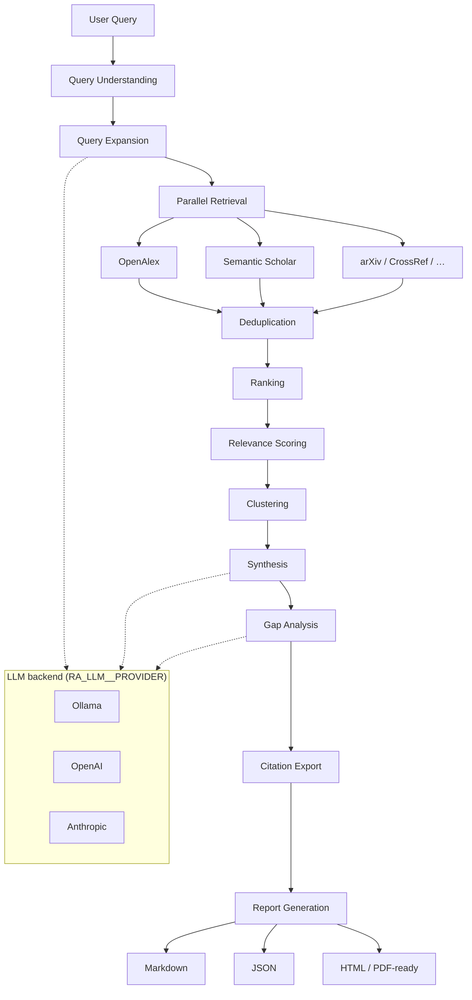

# AI Research Assistant

A local-first research pipeline that retrieves academic papers from multiple scholarly APIs, ranks and clusters them with embeddings, synthesizes cross-paper insights, and exports reports in several formats. Uses **Ollama** by default for fully local LLM inference, with optional **OpenAI** and **Anthropic** providers.

Built with Python 3.13, pydantic-ai, sentence-transformers, and async I/O.

**Documentation:** [https://ndevu12.github.io/Research_Assistant_Model/](https://ndevu12.github.io/Research_Assistant_Model/) — architecture, configuration, API, operations, and known issues.

## Features

- **Multi-stage pipeline** — query understanding → expansion → retrieval → deduplication → ranking → clustering → synthesis → gap analysis → citation export → report generation
- **Local-first LLM** — Ollama with resource-aware model auto-selection (`llama3.1:8b` or `llama3.2:3b`)
- **Cloud LLM support** — OpenAI and Anthropic via `src/models/` provider abstraction
- **Multi-source retrieval** — OpenAlex, Semantic Scholar (arXiv, CrossRef, and others configurable)
- **Embedding-backed stages** — sentence-transformers (`bge-small-en-v1.5`) for dedup, ranking, and clustering
- **Structured output** — Pydantic models throughout; JSON, Markdown, HTML, and print-ready PDF (HTML)
- **Citation export** — BibTeX, APA, MLA, Chicago
- **Session memory** — optional SQLite-backed interactive sessions
- **Auto-setup** — installs dependencies, Ollama, and pulls the configured local model on first run

## Requirements

- Python 3.13+
- [Pipenv](https://pipenv.pypa.io/) for dependency management
- Internet connection (API retrieval; optional for fully offline LLM after model download)

**Local LLM RAM (approximate):**

| Model | RAM | Disk |
|-------|-----|------|
| `llama3.2:3b` | 4–6 GB | ~2.5 GB |
| `llama3.1:8b` | 8–10 GB | ~5 GB |

Cloud providers require only an API key — no Ollama install.

## Quick Start

```bash
pip install pipenv
pipenv install
cp .env.example .env          # optional; edit as needed
pipenv run python -m src "transformer attention mechanisms"
```

On first run with the default Ollama provider, the assistant will:

1. Check Python and embedding dependencies
2. Install or start Ollama if needed
3. Resolve your target model (`auto`, env override, or config)
4. Pull the model if it is not already installed
5. Run the research pipeline

Use **Pipenv** for all commands (`pipenv run python -m src`). Running plain `python -m src` may miss dependencies such as `sentence-transformers`.

While a query runs, the CLI streams **live progress to stderr**: pipeline stage checkmarks, sub-activities (e.g. “Analyzing paper 2/5”), and AI token previews during LLM calls. Disable with `--no-progress` or `RA_PIPELINE__STREAM_PROGRESS=false`.

## Usage

### Command line

```bash
# Interactive mode
pipenv run python -m src

# Single query (markdown output)
pipenv run python -m src "your research query"

# HTML report saved to file
pipenv run python -m src --format html -o reports/report.html "your query"

# Print-ready PDF (HTML — open in browser → Print → Save as PDF)
pipenv run python -m src --format pdf -o reports/report.pdf.html "your query"

# JSON output with citation exports
pipenv run python -m src --format json --export bibtex,apa "your query"

# Session memory in batch mode
pipenv run python -m src --session "your query"
```

### Setup & health check

```bash
pipenv run python -m setups.health_check
pipenv run python -m setups.manager                  # auto-select model
pipenv run python -m setups.manager --model llama3.1:8b
```

See [setups/README.md](setups/README.md) for setup details.

## Configuration

Configuration is layered (highest precedence first):

1. Environment variables (`RA_*` prefix, nested with `__`)
2. Project `.env` file
3. YAML files in `config/` (`default.yaml`, `models.yaml`, `ranking.yaml`, `providers.yaml`)
4. Code defaults

Copy `.env.example` to `.env` to get started.

### Environment variables

#### Retrieval APIs

| Variable | Required | Description |
|----------|----------|-------------|
| `S2_API_KEY` | No | Semantic Scholar API key (higher rate limits) |
| `RA_CROSSREF_MAILTO` | If CrossRef enabled | Email for CrossRef polite pool |
| `CROSSREF_MAILTO` | If CrossRef enabled | Alias for CrossRef mailto |

#### LLM — shared settings

All providers use the `RA_LLM__*` namespace. API keys can also be set via provider-specific env vars (see below) or the unified `RA_LLM__API_KEY`.

| Variable | Default | Description |
|----------|---------|-------------|
| `RA_LLM__PROVIDER` | `ollama` | `ollama`, `openai`, or `anthropic` |
| `RA_LLM__MODEL` | `auto` | Model name, or `auto` for resource-based selection (Ollama only) |
| `RA_LLM__BASE_URL` | provider-specific | API base URL |
| `RA_LLM__API_KEY` | — | Unified API key override for any provider |
| `RA_LLM__TEMPERATURE` | `0.2` | Sampling temperature |
| `RA_LLM__TIMEOUT_SECONDS` | `120` | Request timeout |

#### LLM — Ollama (default)

| Variable | Default | Description |
|----------|---------|-------------|
| `RA_LLM__PROVIDER` | `ollama` | Use local Ollama server |
| `RA_LLM__MODEL` | `auto` | `auto`, `llama3.1:8b`, `llama3.2:3b`, etc. (see `config/ollama_models.yaml`) |
| `RA_LLM__BASE_URL` | `http://localhost:11434/v1` | Ollama OpenAI-compatible endpoint |
| `RA_LLM__API_KEY` | `ollama` | Placeholder key (Ollama ignores it) |
| `OLLAMA_API_KEY` | — | Alternative to `RA_LLM__API_KEY` |

**Model selection:** Set `RA_LLM__MODEL=auto` to pick the best model for your RAM/disk. Override with a specific model name in `.env` (e.g. `RA_LLM__MODEL=llama3.1:8b`). Supported models are listed in `config/ollama_models.yaml`. Setup pulls missing models automatically on startup.

#### LLM — OpenAI

| Variable | Required | Description |
|----------|----------|-------------|
| `RA_LLM__PROVIDER` | Yes | Set to `openai` |
| `RA_LLM__MODEL` | Yes | e.g. `gpt-4o-mini` |
| `OPENAI_API_KEY` | Yes* | OpenAI API key |
| `RA_LLM__API_KEY` | Yes* | Alternative unified key |
| `RA_LLM__BASE_URL` | No | Custom endpoint (defaults to `https://api.openai.com/v1`; use for LM Studio and other OpenAI-compatible servers) |

\* One of `OPENAI_API_KEY` or `RA_LLM__API_KEY` is required.

```bash
RA_LLM__PROVIDER=openai
RA_LLM__MODEL=gpt-4o-mini
OPENAI_API_KEY=sk-...
RA_SYNTHESIS__LLM_ENABLED=true
```

#### LLM — Anthropic

| Variable | Required | Description |
|----------|----------|-------------|
| `RA_LLM__PROVIDER` | Yes | Set to `anthropic` |
| `RA_LLM__MODEL` | Yes | e.g. `claude-3-5-haiku-latest` |
| `ANTHROPIC_API_KEY` | Yes* | Anthropic API key |
| `RA_LLM__API_KEY` | Yes* | Alternative unified key |
| `RA_LLM__BASE_URL` | No | Custom Anthropic-compatible endpoint |

\* One of `ANTHROPIC_API_KEY` or `RA_LLM__API_KEY` is required.

```bash
RA_LLM__PROVIDER=anthropic
RA_LLM__MODEL=claude-3-5-haiku-latest
ANTHROPIC_API_KEY=sk-ant-...
RA_SYNTHESIS__LLM_ENABLED=true
```

#### Pipeline & synthesis

| Variable | Default | Description |
|----------|---------|-------------|
| `RA_SYNTHESIS__LLM_ENABLED` | `false` | Enable LLM-based synthesis (recommended for 8B+ local or cloud models) |
| `RA_RANKING__TOP_K` | `25` | Papers kept after ranking |
| `RA_PIPELINE__DEBUG` | `false` | Verbose pipeline logging |
| `RA_PIPELINE__STREAM_PROGRESS` | `true` | Live stage/LLM progress on stderr (TTY only) |
| `RA_DEBUG` | — | Alias for debug mode (`1`, `true`, `yes`) |
| `RA_CONFIG_DIR` | — | Override path to `config/` directory |

Provider implementations live in `src/models/` (`ollama.py`, `openai.py`, `anthropic.py`). Each resolves API keys via `RA_LLM__API_KEY` first, then the provider-specific env var.

## Project Structure

```
Research_Assistant_Model/
├── config/                     # YAML configuration (merged at runtime)
│   ├── default.yaml            # Base settings
│   ├── models.yaml             # LLM provider overrides
│   ├── ollama_models.yaml      # Supported local models + RAM/disk requirements
│   ├── ranking.yaml            # Ranking weights and top-k
│   └── providers.yaml          # Retrieval provider toggles
│
├── src/                        # Application source
│   ├── __main__.py             # CLI entry point (`python -m src`)
│   ├── config/                 # AppSettings, model auto-selection
│   ├── core/                   # Pipeline engine, stage recovery, metrics
│   ├── retrieval/              # API clients, providers, deduplication
│   │   ├── providers/          # OpenAlex, Semantic Scholar, arXiv, …
│   │   ├── orchestrator.py     # Pipeline facade
│   │   └── models.py           # RetrievedPaper, ResearchReport, …
│   ├── research/               # Query expansion, ranking, clustering
│   ├── analysis/               # Synthesis, gap analysis
│   ├── embeddings/             # sentence-transformers + disk cache
│   ├── models/                 # LLM providers
│   │   ├── ollama.py           # Local Ollama (default)
│   │   ├── openai.py           # OpenAI / compatible endpoints
│   │   ├── anthropic.py        # Anthropic Claude
│   │   └── factory.py          # AgentFactory + provider registry
│   ├── reporting/              # Markdown, HTML, JSON renderers
│   ├── export/                 # BibTeX, APA, MLA, Chicago
│   ├── memory/                 # SQLite session store
│   └── utils/                  # Logging, retry, response handling
│
├── setups/                     # Install & health-check scripts
│   ├── manager.py              # Full setup orchestrator
│   ├── ollama.py               # Ollama install + model pull
│   └── health_check.py         # Validate deps, Ollama, model
│
├── tests/                      # Unit and integration tests
├── reports/                    # Generated reports (gitignored)
├── data/                       # Embeddings cache, SQLite DB (gitignored)
├── logs/                       # Structured logs (gitignored)
├── .env                        # Local secrets (gitignored; see .env.example)
├── Pipfile / Pipfile.lock
└── README.md
```

## Architecture

### End-to-end pipeline

```
┌─────────────────────────────────────────────────────────────────────────────┐
│                              User Query / CLI                               │
└───────────────────────────────────┬─────────────────────────────────────────┘
                                    │
                                    ▼
┌─────────────────────────────────────────────────────────────────────────────┐
│                         QUERY UNDERSTANDING & EXPANSION                     │
│   Parse intent · generate search variants · optional LLM query expansion    │
└───────────────────────────────────┬─────────────────────────────────────────┘
                                    │
                                    ▼
┌─────────────────────────────────────────────────────────────────────────────┐
│                         PARALLEL PAPER RETRIEVAL                            │
│  ┌────────────┐  ┌──────────────────┐  ┌─────────┐  ┌──────────┐            │
│  │  OpenAlex  │  │ Semantic Scholar │  │  arXiv  │  │ CrossRef │  …         │
│  └────────────┘  └──────────────────┘  └─────────┘  └──────────┘            │
└───────────────────────────────────┬─────────────────────────────────────────┘
                                    │
                                    ▼
┌─────────────────────────────────────────────────────────────────────────────┐
│              EMBEDDING-BACKED PROCESSING  (bge-small-en-v1.5)               │
│   Deduplication  →  Ranking  →  Relevance Scoring  →  Clustering            │
└───────────────────────────────────┬─────────────────────────────────────────┘
                                    │
                                    ▼
┌─────────────────────────────────────────────────────────────────────────────┐
│                              ANALYSIS LAYER                                 │
│   Synthesis (heuristic or LLM)  →  Gap Analysis  →  Citation Export         │
└───────────────────────────────────┬─────────────────────────────────────────┘
                                    │
                                    ▼
┌─────────────────────────────────────────────────────────────────────────────┐
│                            REPORT GENERATION                                │
│         Markdown  ·  JSON  ·  HTML  ·  PDF-ready HTML  ·  BibTeX/APA/…      │
└─────────────────────────────────────────────────────────────────────────────┘
```

### LLM provider layer

The analysis stages call one backend selected via `RA_LLM__PROVIDER`:

```
                    ┌──────────────────────────────────────┐
                    │         src/models/ (factory)        │
                    │   AgentFactory · pydantic-ai agents  │
                    └───────────────────┬──────────────────┘
                                        │
              ┌─────────────────────────┼─────────────────────────┐
              │                         │                         │
              ▼                         ▼                         ▼
   ┌────────────────────┐   ┌────────────────────┐   ┌────────────────────┐
   │      Ollama        │   │      OpenAI        │   │     Anthropic      │
   │  (local default)   │   │  gpt-4o-mini, …    │   │  claude-3-5-…      │
   │                    │   │                    │   │                    │
   │ RA_LLM__MODEL=auto │   │ OPENAI_API_KEY     │   │ ANTHROPIC_API_KEY  │
   │ ollama_models.yaml │   │ RA_LLM__API_KEY    │   │ RA_LLM__API_KEY    │
   └────────────────────┘   └────────────────────┘   └────────────────────┘
```

### First-run setup (Ollama)

When `RA_LLM__PROVIDER=ollama`, startup runs this automatically if anything is missing:

```
pipenv run python -m src
        │
        ▼
┌───────────────────┐     no      ┌────────────────────────────┐
│ Ollama installed? │────────────►│ Install Ollama (setups/)   │
└─────────┬─────────┘             └─────────────┬──────────────┘
          │ yes                                 │
          ▼                                     ▼
┌───────────────────┐     no      ┌────────────────────────────┐
│  Ollama running?  │────────────►│ Start ollama serve         │
└─────────┬─────────┘             └─────────────┬──────────────┘
          │ yes                                 │
          ▼                                     ▼
┌───────────────────┐     no      ┌────────────────────────────┐
│  Model installed? │────────────►│ ollama pull <resolved>     │
│  (from .env/auto) │             │ e.g. llama3.1:8b / 3b      │
└─────────┬─────────┘             └─────────────┬──────────────┘
          │ yes                                 │
          └─────────────────┬───────────────────┘
                            ▼
                   Run research pipeline
```

Cloud providers (`openai`, `anthropic`) skip Ollama setup and use API keys directly.

<details>
<summary>Detailed pipeline flow (Mermaid — renders on GitHub)</summary>



</details>

### Configuration precedence

```
  Highest ───────────────────────────────────────────────► Lowest

  ┌─────────────┐   ┌─────────────┐   ┌─────────────┐   ┌─────────────┐
  │  RA_* env   │ → │   .env      │ → │ config/*.yaml│ → │   defaults  │
  │  (shell)    │   │   file      │   │  (merged)    │   │  (in code)  │
  └─────────────┘   └─────────────┘   └─────────────┘   └─────────────┘
```

## Output Format

Reports include query summary, ranked papers, synthesis themes, gap analysis, and citations.

**Example (markdown excerpt):**

```markdown
# Research Report: transformer attention mechanisms

## Executive Summary
Cross-paper synthesis highlights scaled dot-product attention, multi-head variants,
and efficiency techniques for long-context models.

## Thematic Clusters

### 1. Core Attention Architectures
2023 | NeurIPS
DOI: https://doi.org/10.xxxx/xxxxx

Key findings:
- Multi-head attention improves representational capacity
- FlashAttention reduces memory bandwidth bottlenecks

## Research Gaps
- Limited benchmarks on edge-device deployment
- Under-explored sparse attention for retrieval-augmented pipelines
```

**Export formats:**

| `--format` | Output |
|------------|--------|
| `markdown` | Terminal / stdout (default) |
| `json` | Structured `EnhancedResearchReport` JSON |
| `html` | Styled HTML report |
| `pdf` | Print-ready HTML (open → Print → Save as PDF) |

Use `--export bibtex,apa,mla,chicago` alongside any format for citation files.


### Setup / Ollama

```bash
pipenv run python -m setups.health_check
pipenv run python -m setups.manager
```

- **Model not installed** — startup auto-pulls the resolved model; or run `ollama pull <model>` manually
- **Wrong model** — set `RA_LLM__MODEL` in `.env` or use `--model` with setup
- **Ollama not running** — `ollama serve` or re-run setup

### Cloud providers

- Set `RA_LLM__PROVIDER` to `openai` or `anthropic` and provide the API key
- Ollama setup is skipped automatically for non-Ollama providers
- Enable `RA_SYNTHESIS__LLM_ENABLED=true` for LLM-based synthesis

### Missing embeddings / import errors

Always use Pipenv:

```bash
pipenv install
pipenv run python -m src
```

### Logs

```bash
tail -f logs/combined_*.log
```

## Development

### Running locally

```bash
pipenv install --dev
pipenv run pytest
pipenv shell
python -m src
```

### Import paths

**Within the package (relative imports):**

```python
# In src/retrieval/openalex.py
from .models import RetrievedPaper

# In src/analysis/synthesis.py
from ..models import AgentFactory, AgentRole
from ..retrieval.models import RankedPaper
```

**From external scripts (absolute imports):**

```python
from src.retrieval.orchestrator import run_research_helper
from src.models import AgentFactory, create_llm_provider
from setups import run_setup, print_report
```

### Core dependencies

| Package | Role |
|---------|------|
| `pydantic-ai` | LLM agents with structured outputs |
| `aiohttp` | Async HTTP for scholarly APIs |
| `sentence-transformers` | Embeddings for dedup, ranking, clustering |
| `pydantic` / `pydantic-settings` | Schemas and configuration |
| `hdbscan` | Thematic paper clustering |
