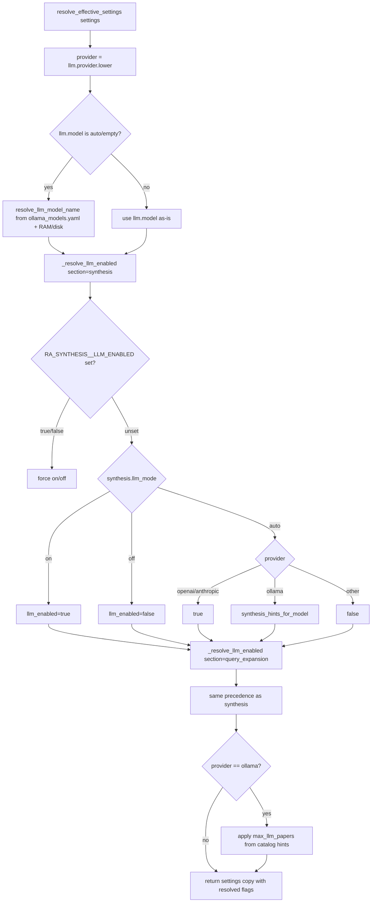
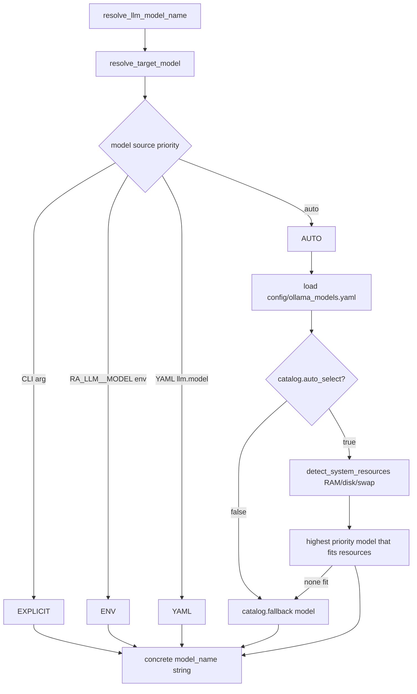
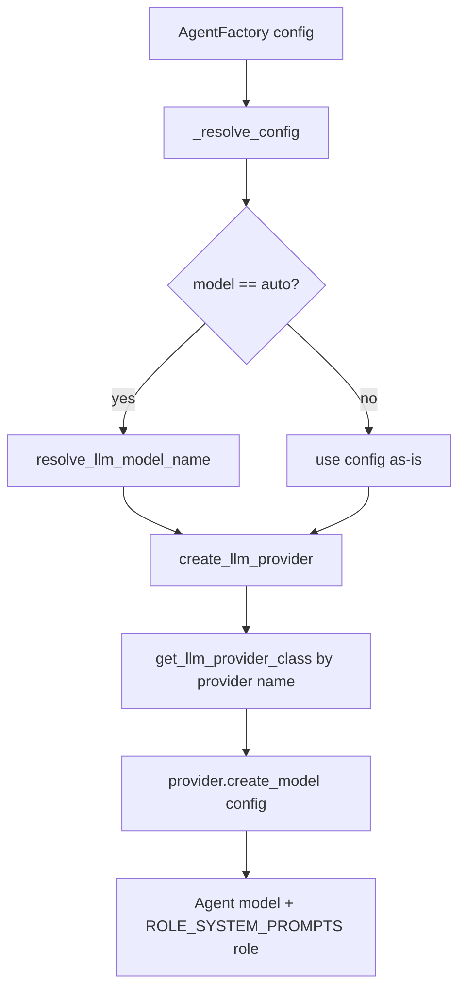
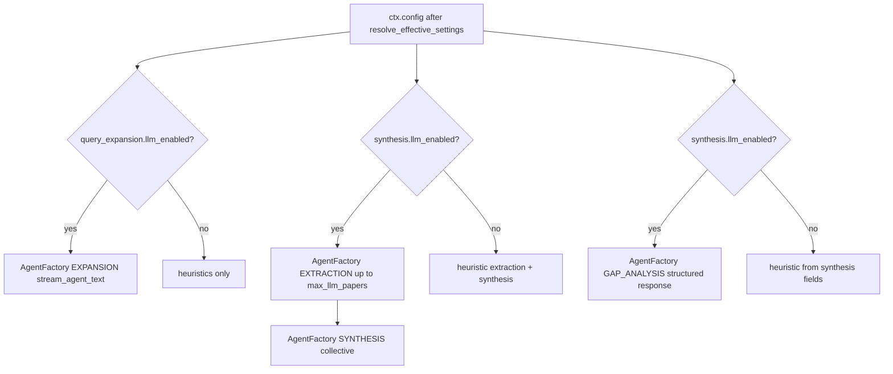

# LLM Resolution Tree

Source: `src/config/settings.py`, `src/config/resolve_llm_features.py`, `src/config/model_selection.py`, `src/models/factory.py`, `src/models/{ollama,openai,anthropic}.py`, `src/models/base.py`.

## Overview

LLM resolution happens in two phases:

1. **Settings load** — `AppSettings` from kwargs/env/.env/YAML/defaults
2. **Pipeline start** — `resolve_effective_settings()` computes feature flags and Ollama hints
3. **Agent creation** — `AgentFactory` resolves `model: auto` → concrete name, then instantiates provider

Embedding model (`embedding.model`) is **separate** from LLM — used by deduplication, ranking, relevance_scoring, clustering.

---

## Phase 1: Settings load

See [config-inventory.md](config-inventory.md) for full field list.

**Key LLM fields:**

| Field | Default | Env |
|-------|---------|-----|
| `llm.provider` | `"ollama"` | `RA_LLM__PROVIDER` |
| `llm.model` | `"auto"` | `RA_LLM__MODEL` |
| `llm.base_url` | `"http://localhost:11434"` | `RA_LLM__BASE_URL` |
| `llm.api_key` | `None` | `RA_LLM__API_KEY` |
| `synthesis.llm_mode` | `"auto"` | `RA_SYNTHESIS__LLM_MODE` |
| `query_expansion.llm_mode` | `"auto"` | `RA_QUERY_EXPANSION__LLM_MODE` |

---

## Phase 2: Feature flag resolution (`resolve_effective_settings`)

Called from `ResearchPipeline.execute()` before stages run.

### Precedence per feature (synthesis, query_expansion)

1. `RA_{SECTION}__LLM_ENABLED` env override (`true`/`false`/`1`/`0`/etc.)
2. `llm_mode: on` → enabled; `llm_mode: off` → disabled
3. `llm_mode: auto` → rules below

### Auto-mode rules (`_resolve_auto_llm_enabled`)

| Provider | synthesis LLM | query_expansion LLM |
|----------|---------------|---------------------|
| `openai`, `anthropic` | **Always enabled** | **Always enabled** |
| `ollama` | Enabled if `ollama_models.yaml` entry has `synthesis.llm_enabled: true` for resolved model | Same catalog hint |
| Other | Disabled | Disabled |

### Ollama synthesis hints

When provider is `ollama` and model resolves from catalog, `max_llm_papers` may be updated from catalog entry (e.g. 8B model → 5 papers).

---

## Phase 3: Model name resolution (`model_selection.py`)

When `llm.model` is `"auto"` or empty:

**Resource detection:** RAM, disk, swap pressure can downgrade model selection (see `tests/test_model_selection.py`).

---

## Phase 4: Provider and agent creation (`factory.py`)

### LLM provider registry

| Provider key | Class | File | Model backend |
|--------------|-------|------|---------------|
| `ollama` | `OllamaProvider` | `src/models/ollama.py` | OpenAI-compatible API at normalized `base_url` |
| `openai` | `OpenAIProviderImpl` | `src/models/openai.py` | pydantic-ai OpenAI model |
| `anthropic` | `AnthropicProviderImpl` | `src/models/anthropic.py` | pydantic-ai Anthropic model |

### API key resolution

| Provider | Key sources (priority) |
|----------|------------------------|
| Ollama | `RA_LLM__API_KEY` → `OLLAMA_API_KEY` → default `"ollama"` |
| OpenAI | `RA_LLM__API_KEY` → `OPENAI_API_KEY` (required) |
| Anthropic | `RA_LLM__API_KEY` → `ANTHROPIC_API_KEY` (required) |

### Base URL normalization (Ollama / OpenAI-compatible)

`normalize_openai_base_url()` appends `/v1` if missing — explains discrepancy between code default (`http://localhost:11434`) and `.env.example` (`.../v1`).

---

## Agent roles in pipeline

| Role | Enum | Used in stage | Purpose |
|------|------|---------------|---------|
| `EXPANSION` | `AgentRole.EXPANSION` | query_expansion | JSON variants + sub_questions |
| `EXTRACTION` | `AgentRole.EXTRACTION` | synthesis Pass A | Per-paper structured extraction |
| `SYNTHESIS` | `AgentRole.SYNTHESIS` | synthesis Pass B | Cross-paper synthesis JSON |
| `GAP_ANALYSIS` | `AgentRole.GAP_ANALYSIS` | gap_analysis | Gaps/opportunities JSON |
| `ANALYSIS` | `AgentRole.ANALYSIS` | `src/analysis/llm.py` only | Legacy module-level agent |

---

## Runtime LLM call sites (after resolution)

**Important coupling:** Gap analysis LLM is gated by **`synthesis.llm_enabled`**, not a separate `gap_analysis.llm_mode`.

---

## Test coverage (`tests/test_resolve_llm_features.py`)

| Test | Confirms |
|------|----------|
| `test_llm_mode_auto_8b` | Ollama 8B + auto → both features enabled, `max_llm_papers=5` |
| `test_llm_mode_auto_3b` | Ollama 3B + auto → both features disabled |
| `test_llm_mode_on_off` | Explicit on/off overrides catalog |
| `test_env_llm_enabled_overrides_mode` | `RA_SYNTHESIS__LLM_ENABLED` overrides `llm_mode: off` |
| `test_cloud_provider_auto_enables_llm` | OpenAI + auto → both enabled |
| `test_auto_resolves_model_name` | End-to-end YAML + auto resolution |

---

## Known gaps (document in Phase 1)

| Issue | Detail |
|-------|--------|
| `llm.timeout_seconds` | Configured but unused; stage timeouts are pipeline-level |
| `llm.temperature` | Not passed to pydantic-ai model constructors |
| `expand_query_llm` | Uses `get_settings().llm` instead of `ctx.config.llm` |
| `analysis/llm.py` | Global agent at import — separate from pipeline |
| Default quality | `synthesis.llm_enabled=false` + `query_expansion.llm_enabled=false` → heuristic reports |

## Default quality implications

With Ollama `llama3.2:3b` (fallback) and `llm_mode: auto`:

- Synthesis LLM: **off**
- Query expansion LLM: **off**
- Gap analysis: **heuristic** (derived from synthesis heuristics)
- Report placeholders: *"Details inferred from abstract only"*, etc.

See `docs/quality/known-issues.md` for user-facing quality analysis.
