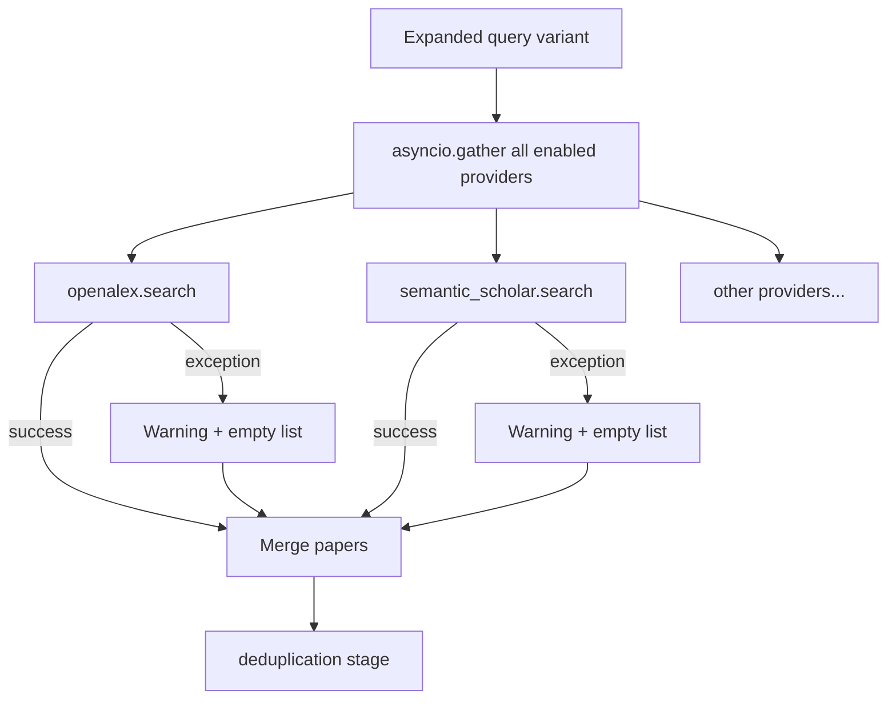

# Provider HTTP Matrix — Retrieval

Source: `src/retrieval/providers/`, `src/retrieval/providers/registry.py`, `src/retrieval/retrieval_stage.py`, `src/retrieval/orchestrator.py`.

**HTTP client:** `aiohttp` (session created in `RetrievalStage` or passed to health checks).

## Provider summary

| Key | File | Status | Base URL / endpoint | Auth | Retries / timeouts | YAML enable key |
|-----|------|--------|---------------------|------|-------------------|-----------------|
| `openalex` | `openalex.py` | **Live** | `GET https://api.openalex.org/works?search=&per-page=` | None | 3 retries, exp backoff; search **60s**, health **15s** | `retrieval.providers.openalex.enabled` (default `true`) |
| `semantic_scholar` | `semantic_scholar.py` | **Live** | `GET https://api.semanticscholar.org/graph/v1/paper/search/bulk?query=&limit=&fields=...` | `S2_API_KEY` → `x-api-key` header (optional) | 3 retries; **429** → sleep `Retry-After` (default 60s); search **60s**, health **15s** | `retrieval.providers.semantic_scholar.enabled` (default `true`) |
| `arxiv` | `arxiv.py` | **Live** | `GET https://export.arxiv.org/api/query?search_query=&start=0&max_results=` | None | 3 retries; search **60s**, health **15s** | `retrieval.providers.arxiv.enabled` (default `false`) |
| `crossref` | `crossref.py` | **Live** | `GET https://api.crossref.org/works?query=&rows=` | `RA_CROSSREF_MAILTO` or `CROSSREF_MAILTO` → `User-Agent: ResearchAssistant/1.0 (mailto:…)` | 3 retries; **429** → `Retry-After`; search **60s**, health **15s** | `retrieval.providers.crossref.enabled` (default `false`) |
| `pubmed` | `pubmed.py` | **Stub** | Planned NCBI E-utilities | — | `NotImplementedError` on `search()` | `retrieval.providers.pubmed.enabled` (default `false`) |
| `core` | `core_provider.py` | **Stub** | Planned CORE API v3 | — | `NotImplementedError` on `search()` | `retrieval.providers.core.enabled` (default `false`) |
| `dblp` | `dblp.py` | **Stub** | Planned DBLP JSON API | — | `NotImplementedError` on `search()` | `retrieval.providers.dblp.enabled` (default `false`) |

**Stub base:** `src/retrieval/providers/_stub_base.py` — `search()` raises `NotImplementedError`; `health_check()` returns unhealthy.

## Registry and selection

```
get_enabled_providers(settings)
  → iterate settings.retrieval.providers
  → skip if enabled=false or name not in _PROVIDER_CLASSES
  → create_provider(name, config)
```

File: `src/retrieval/providers/registry.py:62–76`

**Extensibility:** `register_provider()` adds to `_PROVIDER_CLASSES` (tested in `test_phase3_extensibility.py`).

## Per-provider details

### OpenAlex (`openalex`)

| Attribute | Value |
|-----------|-------|
| Search URL | `https://api.openalex.org/works` |
| Query params | `search`, `per-page` |
| Auth | None |
| Rate limiting | Retry on failure; no explicit 429 handler |
| Normalization | Maps OpenAlex work JSON → `RetrievedPaper` |
| Health check | Lightweight query against works endpoint, 15s timeout |

### Semantic Scholar (`semantic_scholar`)

| Attribute | Value |
|-----------|-------|
| Search URL | `https://api.semanticscholar.org/graph/v1/paper/search/bulk` |
| Fields requested | `title,abstract,year,venue,url,externalIds` |
| Auth | `S2_API_KEY` env → optional `x-api-key` header |
| Rate limiting | 429 handling with `Retry-After` header |
| Health check | Minimal search, 15s timeout |

### arXiv (`arxiv`)

| Attribute | Value |
|-----------|-------|
| Search URL | `https://export.arxiv.org/api/query` |
| Query format | Preserves arXiv field syntax (e.g. `ti:`, `abs:`) |
| Auth | None |
| Health check | `max_results=1`, 15s timeout |

### CrossRef (`crossref`)

| Attribute | Value |
|-----------|-------|
| Search URL | `https://api.crossref.org/works` |
| Query params | `query`, `rows` |
| Auth | Polite pool via mailto in User-Agent (optional but recommended) |
| Rate limiting | 429 handling with `Retry-After` |
| Health check | `rows=1`, 15s timeout |

### Stubs (PubMed, CORE, DBLP)

| Attribute | Value |
|-----------|-------|
| Registration | Present in `_PROVIDER_CLASSES`; default `enabled=false` |
| `search()` | Raises `NotImplementedError` |
| `health_check()` | Returns `healthy=False` with stub message |
| Normalization | Field maps defined for future implementation |
| Risk | Enabling in YAML → caught by `_safe_search` → warning + empty results per provider |

## Retrieval stage behavior

File: `src/retrieval/retrieval_stage.py`

| Behavior | Detail |
|----------|--------|
| Provider limit | Always uses `settings.retrieval.per_provider_limit` — **ignores** `ProviderConfig.limit` |
| Concurrency | `settings.retrieval.concurrency_limit` caps parallel searches across expanded query variants |
| Per-query providers | All enabled providers searched in parallel via `asyncio.gather` |
| Failure handling | `_safe_search` catches exceptions → warning, empty list for that provider |
| Partial flag | Stage marked partial when any provider fails |
| Cache bypass | `cached_papers` initial artifact skips network if session cache hit |

## CLI vs full pipeline

| Aspect | Full pipeline (`run_research` / API) | CLI helper (`run_research_helper`) |
|--------|--------------------------------------|-------------------------------------|
| File | `orchestrator.py:110–187` | `orchestrator.py:190–276` |
| Settings | Full `AppSettings()` merge | Constructor override replaces `providers` dict |
| Providers | All `enabled=true` in config | **Hardcoded:** OpenAlex + Semantic Scholar only |
| Limit | `per_provider_limit` (default 8) | `k_each` param → `per_provider_limit` + both provider limits |
| YAML toggles | Honored (e.g. enable arXiv) | **Ignored** for provider set |
| Entry points | API, interactive session, programmatic | `python -m src "query"` |

```python
# orchestrator.py:207–215 — CLI helper override
settings = AppSettings(
    retrieval={
        "per_provider_limit": k_each,
        "providers": {
            "openalex": {"enabled": True, "limit": k_each},
            "semantic_scholar": {"enabled": True, "limit": k_each},
        },
    }
)
```

## Config key quick reference

| Config key | Default | Used by pipeline? |
|------------|---------|-------------------|
| `retrieval.concurrency_limit` | `4` | Yes |
| `retrieval.per_provider_limit` | `8` | Yes (actual search limit) |
| `retrieval.providers.<name>.enabled` | see defaults | Yes (full pipeline only) |
| `retrieval.providers.<name>.limit` | `8` | **No** (overridden by `per_provider_limit`) |

## Env override examples

```bash
RA_RETRIEVAL__PROVIDERS__ARXIV__ENABLED=true
RA_RETRIEVAL__PROVIDERS__CROSSREF__ENABLED=true
RA_RETRIEVAL__PER_PROVIDER_LIMIT=10
RA_RETRIEVAL__CONCURRENCY_LIMIT=6
S2_API_KEY=your_key
RA_CROSSREF_MAILTO=you@example.com
```

## Graceful fallback flow



## Documentation admonitions (Phase 1)

```markdown
!!! warning "Stub provider"
    PubMed is not yet implemented. Enabling it raises `NotImplementedError`
    (caught gracefully — empty results for that provider).

!!! info "CLI vs full pipeline"
    `python -m src "query"` uses OpenAlex + Semantic Scholar only via
    `run_research_helper`. Enable additional providers via config when using
    the API or programmatic `build_pipeline()`.
```
