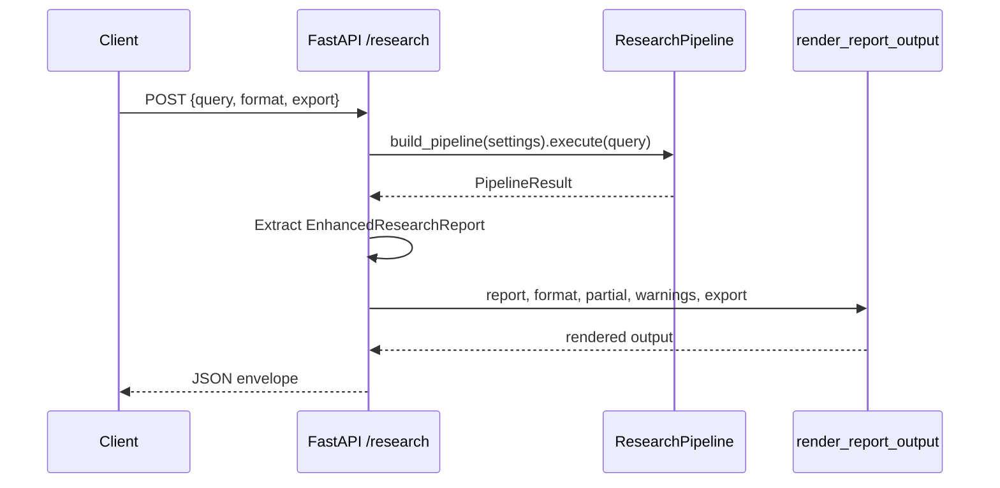

# API Endpoints

Route definitions in `src/api/app.py`. All routes are async. Request/response models use Pydantic v2.

Base URL (local default): `http://127.0.0.1:8000`

Interactive OpenAPI UI: `http://127.0.0.1:8000/docs`

## GET `/health`

Returns service status and registered plugin names.

### Response schema

```json
{
  "status": "ok",
  "providers": ["arxiv", "core", "crossref", "dblp", "openalex", "pubmed", "semantic_scholar"],
  "stages": [
    "citation_export",
    "clustering",
    "deduplication",
    "gap_analysis",
    "query_expansion",
    "query_understanding",
    "ranking",
    "relevance_scoring",
    "report_generation",
    "retrieval",
    "synthesis"
  ]
}
```

| Field | Type | Description |
|-------|------|-------------|
| `status` | string | Always `"ok"` when the app is running |
| `providers` | string[] | Registered retrieval provider keys (includes stubs) |
| `stages` | string[] | Registered pipeline stage names |

### Example

```bash
curl -s http://127.0.0.1:8000/health | jq
```

Use for load-balancer probes and verifying `bootstrap_default_plugins()` ran successfully.

---

## GET `/providers`

Lists registered retrieval provider names only.

### Response schema

```json
{
  "providers": ["arxiv", "core", "crossref", "dblp", "openalex", "pubmed", "semantic_scholar"]
}
```

### Example

```bash
curl -s http://127.0.0.1:8000/providers | jq '.providers'
```

!!! warning "Stub providers listed"
    PubMed, CORE, and DBLP appear in the list but raise `NotImplementedError` on search when enabled. See [Provider matrix](../retrieval/provider-matrix.md).

---

## POST `/research`

Runs the full research pipeline for a query and returns structured report data plus rendered output.

### Request schema

```json
{
  "query": "transformer attention mechanisms",
  "format": "json",
  "export": ["bibtex", "apa"]
}
```

| Field | Type | Required | Constraints |
|-------|------|----------|-------------|
| `query` | string | **Yes** | Min length 1 |
| `format` | string | No | Default `"json"`. Pattern: `markdown` \| `json` \| `html` |
| `export` | string[] \| null | No | Citation export formats passed to `render_report_output` |

!!! info "No PDF format"
    Unlike the CLI, the API does not accept `format: pdf`. Use `html` and print-to-PDF client-side, or call the CLI with `--format pdf`.

### Success response schema

```json
{
  "query": "transformer attention mechanisms",
  "format": "markdown",
  "partial": false,
  "warnings": [],
  "duration_ms": 7420.5,
  "session_id": "abc123",
  "metrics": {
    "stages": {},
    "retrieval": {},
    "llm_tokens_in": 0,
    "llm_tokens_out": 0
  },
  "report": {
    "query": "transformer attention mechanisms",
    "executive_summary": "...",
    "papers": [],
    "themes": [],
    "gaps": [],
    "metadata": {}
  },
  "rendered": "# Research Report\n\n..."
}
```

| Field | Type | Description |
|-------|------|-------------|
| `partial` | boolean | `true` if any stage returned partial success |
| `warnings` | string[] | Human-readable stage warnings |
| `duration_ms` | number | Wall-clock pipeline duration |
| `session_id` | string \| null | Session identifier from pipeline context |
| `metrics` | object | Aggregated pipeline metrics |
| `report` | object | Full `EnhancedResearchReport` JSON |
| `rendered` | string or object | Markdown/HTML string, or JSON dict when `format=json` |

### Example: JSON report

```bash
curl -s -X POST http://127.0.0.1:8000/research \
  -H "Content-Type: application/json" \
  -d '{"query": "graph neural networks survey", "format": "json"}' \
  | jq '.report.executive_summary'
```

### Example: Markdown rendered output

```bash
curl -s -X POST http://127.0.0.1:8000/research \
  -H "Content-Type: application/json" \
  -d '{"query": "reinforcement learning robotics", "format": "markdown"}' \
  | jq -r '.rendered'
```

### Example: With citation export

```bash
curl -s -X POST http://127.0.0.1:8000/research \
  -H "Content-Type: application/json" \
  -d '{
    "query": "diffusion models",
    "format": "json",
    "export": ["bibtex", "apa"]
  }' | jq '.rendered'
```

The `export` list is forwarded to `render_report_output()` alongside the main format. Exact export keys in the response depend on the reporting layer — see [Output formats](../user-guide/output-formats.md).

### Error responses

| Status | Cause | Body |
|--------|-------|------|
| 422 | Invalid request (empty query, bad format) | FastAPI validation detail |
| 500 | Unhandled pipeline exception | `{"detail": "<error message>"}` |

Pipeline stages that fail partially still return **200** with `partial: true` and populated `warnings` — only uncaught exceptions produce 500.

### Internal flow



Report extraction fallback: if `result.output` is not an `EnhancedResearchReport`, the handler checks `result.artifacts["enhanced_report"]`, then creates an empty report with the query string.

## Programmatic usage

```python
import asyncio
from httpx import ASGITransport, AsyncClient

from src.api.app import create_app
from src.config.settings import AppSettings

async def main() -> None:
    app = create_app(AppSettings())
    transport = ASGITransport(app=app)
    async with AsyncClient(transport=transport, base_url="http://test") as client:
        response = await client.post(
            "/research",
            json={"query": "test query", "format": "json"},
        )
        data = response.json()
        assert data["query"] == "test query"

asyncio.run(main())
```

Requires `httpx` (not a core dependency) for ASGI testing.

## Related pages

- [API overview](index.md) — install, CLI comparison, limitations
- [Output formats](../user-guide/output-formats.md) — format details and CLI parity
- [Architecture overview](../architecture/overview.md) — what the pipeline runs
