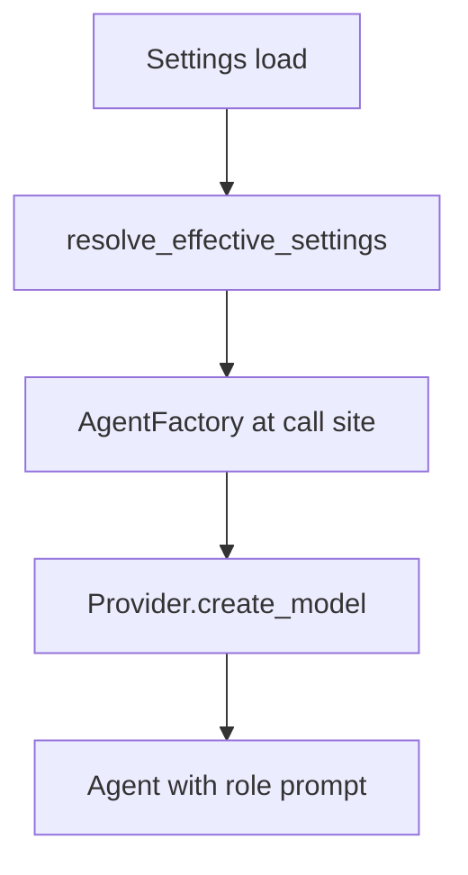
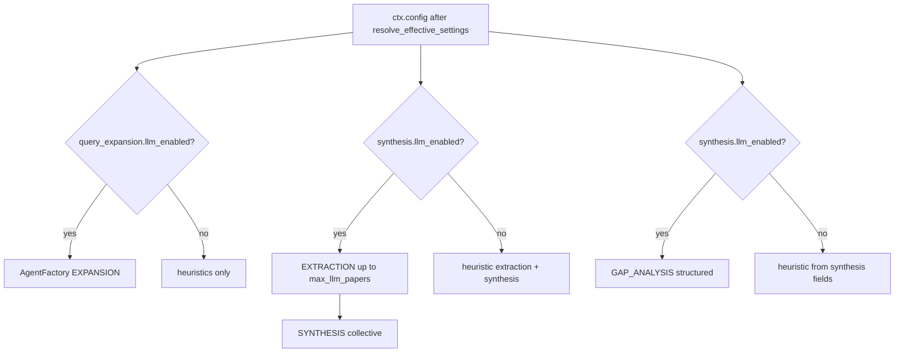

# LLM Layer

The LLM layer provides chat-model agents for query expansion, synthesis, and gap analysis. It is separate from the **embedding model** used by ranking, deduplication, relevance scoring, and clustering.

Source: `src/models/`, `src/config/resolve_llm_features.py`, `src/config/model_selection.py`.

## Resolution phases

LLM behavior is determined in three phases before any stage makes a call:

### Phase 1: Settings load

`AppSettings` merges kwargs → `RA_*` env vars → `.env` → YAML → defaults. Key LLM fields:

| Field | Default | Env override |
|-------|---------|--------------|
| `llm.provider` | `"ollama"` | `RA_LLM__PROVIDER` |
| `llm.model` | `"auto"` | `RA_LLM__MODEL` |
| `llm.base_url` | `"http://localhost:11434"` | `RA_LLM__BASE_URL` |
| `llm.api_key` | `None` | `RA_LLM__API_KEY` |
| `synthesis.llm_mode` | `"auto"` | `RA_SYNTHESIS__LLM_MODE` |
| `query_expansion.llm_mode` | `"auto"` | `RA_QUERY_EXPANSION__LLM_MODE` |

### Phase 2: Feature flag resolution

`resolve_effective_settings()` runs at pipeline start (`ResearchPipeline.execute()`). It sets `synthesis.llm_enabled` and `query_expansion.llm_enabled` on a copy of settings passed to all stages via `ctx.config`.

**Precedence per feature** (synthesis, query_expansion):

1. `RA_{SECTION}__LLM_ENABLED` env override (`true`/`false`/`1`/`0`)
2. `llm_mode: on` → enabled; `llm_mode: off` → disabled
3. `llm_mode: auto` → rules below

**Auto-mode rules:**

| Provider | synthesis LLM | query_expansion LLM |
|----------|---------------|---------------------|
| `openai`, `anthropic` | Always enabled | Always enabled |
| `ollama` | Enabled if `ollama_models.yaml` entry has `synthesis.llm_enabled: true` for resolved model | Same catalog hint |
| Other | Disabled | Disabled |

!!! warning "Default quality"
    With Ollama `llama3.2:3b` (fallback) and `llm_mode: auto`, both synthesis and query expansion LLM are **off**. Reports use heuristics. See [Heuristic vs LLM](../llm/heuristic-vs-llm.md).

When provider is Ollama and model resolves from catalog, `max_llm_papers` may be updated from catalog hints (e.g., 8B model → 5 papers).

### Phase 3: Model name resolution

When `llm.model` is `"auto"` or empty, `resolve_llm_model_name()` in `src/config/model_selection.py`:

1. Loads `config/ollama_models.yaml`
2. If `auto_select: true`, detects system resources (RAM, disk, swap)
3. Picks highest-priority model that fits resources
4. Falls back to catalog `fallback` model if none fit

Explicit model names (CLI, env, or YAML) skip auto-selection.

### Phase 4: Provider and agent creation

`AgentFactory` (`src/models/factory.py`) resolves config, instantiates the provider, creates a pydantic-ai `Agent` with the role system prompt.

## Provider registry

| Provider key | Class | Backend |
|--------------|-------|---------|
| `ollama` | `OllamaProvider` | OpenAI-compatible API at normalized `base_url` |
| `openai` | `OpenAIProviderImpl` | pydantic-ai OpenAI model |
| `anthropic` | `AnthropicProviderImpl` | pydantic-ai Anthropic model |

Register custom providers with `register_llm_provider()`.

## API key resolution

| Provider | Key sources (priority) |
|----------|------------------------|
| Ollama | `RA_LLM__API_KEY` → `OLLAMA_API_KEY` → default `"ollama"` |
| OpenAI | `RA_LLM__API_KEY` → `OPENAI_API_KEY` (required) |
| Anthropic | `RA_LLM__API_KEY` → `ANTHROPIC_API_KEY` (required) |

## Base URL normalization

`normalize_openai_base_url()` appends `/v1` if missing. The code default is `http://localhost:11434`; `.env.example` may show `http://localhost:11434/v1` — both resolve to the same endpoint.

## Agent roles

| Role | Enum | Stage | Purpose |
|------|------|-------|---------|
| EXPANSION | `AgentRole.EXPANSION` | query_expansion | JSON variants + sub_questions |
| EXTRACTION | `AgentRole.EXTRACTION` | synthesis (Pass A) | Per-paper structured extraction |
| SYNTHESIS | `AgentRole.SYNTHESIS` | synthesis (Pass B) | Cross-paper synthesis JSON |
| GAP_ANALYSIS | `AgentRole.GAP_ANALYSIS` | gap_analysis | Gaps/opportunities JSON |
| ANALYSIS | `AgentRole.ANALYSIS` | `src/analysis/llm.py` only | Legacy module-level agent |

## Runtime call sites

!!! info "Gap analysis coupling"
    Gap analysis LLM is gated by **`synthesis.llm_enabled`**, not a separate `gap_analysis.llm_mode`.

## Embedding model (separate)

The chat LLM and embedding model are independent:

| Component | Config | Used by |
|-----------|--------|---------|
| Chat LLM | `llm.*` | query_expansion, synthesis, gap_analysis |
| Embeddings | `embedding.*` | deduplication, ranking, relevance_scoring, clustering |

Embedding provider: sentence-transformers via `src/embeddings/`. If not installed, embedding-dependent features degrade gracefully with warnings.

## Non-pipeline LLM module

`src/analysis/llm.py` creates a module-level `analysis_agent` at import via `AgentFactory()` — **not** part of the 11-stage pipeline. Used by legacy/orchestrator helper paths.

## Known gaps

| Issue | Detail |
|-------|--------|
| `llm.timeout_seconds` | Configured but unused; stage timeouts are pipeline-level |
| `llm.temperature` | Not passed to pydantic-ai model constructors |
| `expand_query_llm` | Uses `get_settings().llm` instead of `ctx.config.llm` |
| `analysis/llm.py` | Global agent at import — separate from pipeline |

## Related pages

- [Ollama](../llm/ollama.md) — auto-select, catalog, setup integration
- [Cloud providers](../llm/cloud-providers.md) — OpenAI, Anthropic
- [Heuristic vs LLM](../llm/heuristic-vs-llm.md) — quality tradeoffs
- [Synthesis stage](stages/synthesis.md) — two-pass LLM flow
- [Environment variables](../configuration/environment-variables.md)
