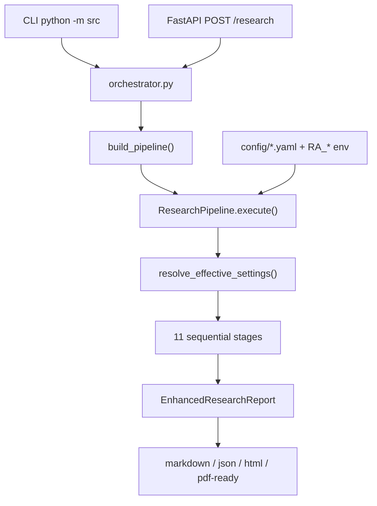

# Architecture Overview

The AI Research Assistant is a local-first, multi-stage Python research pipeline. A user query flows through eleven sequential stages that retrieve scholarly papers, rank and cluster them, synthesize findings, and assemble a structured report.

## Entry points

| Entry point | Module | Pipeline used |
|-------------|--------|---------------|
| CLI (`python -m src "query"`) | `src/__main__.py` → `run_research_helper()` | Full 11-stage pipeline, but **hardcodes OpenAlex + Semantic Scholar only** |
| CLI (programmatic) | `run_research()` / `run_research_with_result()` | Full pipeline with loaded `AppSettings` |
| FastAPI | `src/api/app.py` → `POST /research` | Full pipeline with request/config overrides |

!!! info "CLI vs full pipeline"
    `run_research_helper()` builds a minimal `AppSettings` with only OpenAlex and Semantic Scholar enabled. To use arXiv, CrossRef, or other providers, call `run_research()` with a custom config or use the API. See [Retrieval overview](../retrieval/overview.md).

## End-to-end flow



## Project structure

```
src/
├── __main__.py          # CLI entry
├── api/app.py           # Optional FastAPI layer
├── config/              # AppSettings, YAML loading, LLM resolution
├── core/                # Pipeline, context, registry, stage recovery
├── research/            # Query understanding, expansion, ranking, clustering
├── retrieval/           # Providers, retrieval stage, deduplication
├── analysis/            # Synthesis, gap analysis
├── reporting/           # Citations, report assembly, markdown render
├── models/              # LLM provider factory (Ollama, OpenAI, Anthropic)
├── embeddings/          # Sentence-transformer embedding provider
└── memory/              # Session cache and persistence
```

Configuration lives in `config/*.yaml` and is overridden by `.env` and `RA_*` environment variables. See [Configuration precedence](../configuration/precedence.md).

## Pipeline orchestration

`build_pipeline()` in `src/retrieval/orchestrator.py` constructs a `ResearchPipeline` with eleven stage instances in fixed order. The pipeline is registered in `src/core/registry.py` for extensibility.

**Execution model** (`src/core/pipeline.py`):

1. `resolve_effective_settings()` runs once at pipeline start — resolves LLM feature flags and Ollama model hints.
2. Each enabled stage runs sequentially; stage output becomes the next stage's `data` input.
3. Stages also read/write a shared **artifact store** on `PipelineContext` for cross-stage data (embeddings, ranked papers, synthesis, etc.).
4. Disabled stages (`pipeline.enabled_stages.*`) are skipped entirely.
5. Timeouts default to 300 s per stage; synthesis uses 600 s (`pipeline.synthesis_timeout_seconds`).
6. On failure or timeout, `continue_on_stage_failure` (default `true`) triggers heuristic recovery via `src/core/stage_recovery.py`.
7. When `debug_enabled`, a JSON dump is written to `logs/debug/pipeline_*.json`.

## Data flow summary


Side-channel artifacts (embeddings, analyses, citation index) are stored on `PipelineContext` and documented in [Artifacts](artifacts.md).

## Key design decisions

| Decision | Rationale |
|----------|-----------|
| Sequential stages with typed `data` chain | Simple debugging, clear stage boundaries, easy enable/disable |
| Shared artifact store | Embeddings and ranked papers needed by multiple downstream stages |
| Heuristic defaults for LLM stages | Fast local runs without GPU/API; quality tradeoff documented in [Heuristic vs LLM](../llm/heuristic-vs-llm.md) |
| Graceful degradation | Partial reports with warnings rather than hard failure on single-stage errors |
| Separate embedding model | Ranking, dedup, relevance, and clustering use `embedding.*` config — independent of chat LLM |

## Related pages

- [Pipeline stages](pipeline-stages.md) — stage index and config overview
- [Stage deep dives](stages/query-understanding.md) — per-stage reference
- [Artifacts](artifacts.md) — artifact key registry and producers/consumers
- [Data model](data-model.md) — Pydantic types through the pipeline
- [LLM layer](llm-layer.md) — provider factory, roles, and resolution
