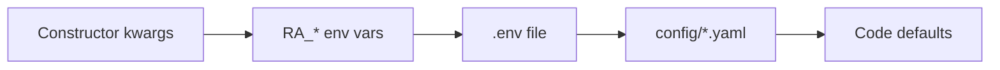

# Configuration Precedence

Settings are loaded by `AppSettings` in `src/config/settings.py`. Understanding the merge order helps explain why a YAML value “doesn’t stick” or why `.env.example` behaves differently on a fresh clone.

## Load order (highest to lowest)

| Priority | Source | Mechanism |
|----------|--------|-----------|
| 1 (highest) | Constructor kwargs | `AppSettings(retrieval={...})` — used by CLI helper and tests |
| 2 | Process environment | `RA_` prefix, nested keys via `__` (e.g. `RA_LLM__MODEL`) |
| 3 | `.env` file | Same rules as env; loaded via pydantic-settings `env_file` |
| 4 | Merged YAML | `config/default.yaml` + overlays (`models.yaml`, `ranking.yaml`, `providers.yaml`) |
| 5 (lowest) | Pydantic field defaults | Defined on nested models in `settings.py` |



Source: `AppSettings.settings_customise_sources()` returns `(init_settings, env_settings, dotenv_settings, YamlSettingsSource)`.

## YAML merge behavior

`load_yaml_config()` deep-merges files in this order:

1. **`default.yaml`** — full settings tree (base)
2. **`models.yaml`** — merged into `llm`
3. **`ranking.yaml`** — merged into `ranking`
4. **`providers.yaml`** — merged into `retrieval`

Files **not** loaded by `AppSettings`:

| File | Loaded by | Purpose |
|------|-----------|---------|
| `ollama_models.yaml` | `model_selection.py` | Ollama catalog, RAM/disk hints, synthesis defaults |
| `canonical_works.yaml` | `canonical_works.py` | Optional ranking boost for known works |

Override the config directory with `RA_CONFIG_DIR=/path/to/config`.

## Post-load resolution

At pipeline start, `resolve_effective_settings()` computes runtime values that depend on LLM provider and Ollama model catalog:

- `synthesis.llm_enabled`
- `query_expansion.llm_enabled`
- Ollama `max_llm_papers` hints from `ollama_models.yaml`

These can differ from raw YAML/env until the pipeline runs. See [Heuristic vs LLM](../llm/heuristic-vs-llm.md).

## Alternate loader: `AppSettings.from_yaml()`

For tests or isolated config directories:

```python
from src.config.settings import AppSettings

settings = AppSettings.from_yaml(config_dir=Path("tests/fixtures/config"))
```

Precedence: **constructor overrides > process environment > YAML > defaults**. This loader **skips `.env`**, so local developer overrides do not leak into test configs.

## Common pitfalls

!!! warning "`.env.example` enables debug by default"
    The shipped `.env.example` sets `RA_DEBUG=1`, which turns on debug dumps even when `RA_PIPELINE__DEBUG=false`. Remove or comment it for quiet runs.

!!! info "Ollama base URL"
    Code default is `http://localhost:11434` (no `/v1`). `.env.example` uses `/v1`. Ollama providers normalize via `normalize_openai_base_url()` — both work.

!!! info "Per-provider `limit` vs `per_provider_limit`"
    Each provider has a `limit` field in YAML, but the retrieval stage always uses `retrieval.per_provider_limit`. Per-provider limits in YAML are currently **ignored** at search time.

## Override examples

**YAML** (`config/providers.yaml`):

```yaml
retrieval:
  providers:
    arxiv:
      enabled: true
```

**Equivalent env:**

```bash
RA_RETRIEVAL__PROVIDERS__ARXIV__ENABLED=true
```

**Programmatic (highest precedence):**

```python
settings = AppSettings(
    retrieval={
        "providers": {
            "openalex": {"enabled": True},
            "semantic_scholar": {"enabled": True},
            "arxiv": {"enabled": True},
        }
    }
)
```

See also: [Environment variables](environment-variables.md), [YAML reference](yaml-reference.md), [Stage toggles](stage-toggles.md).
