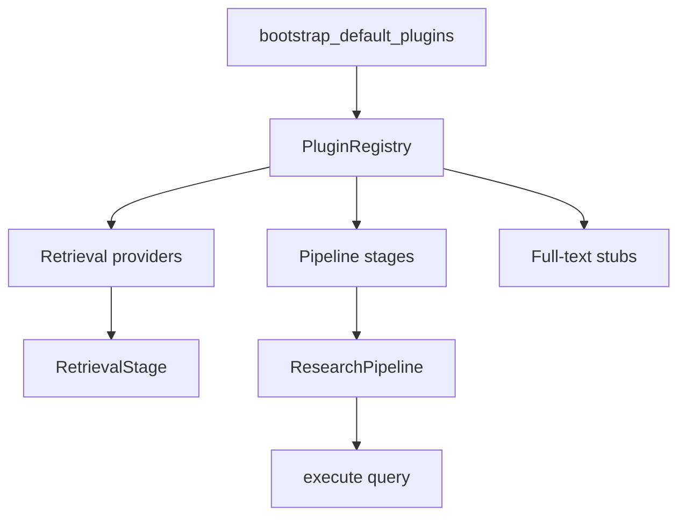

# Extensibility

The research pipeline is composable through registries for retrieval providers, LLM providers, pipeline stages, and full-text extensions. Built-ins register at startup via `bootstrap_default_plugins()`.

Source: `src/core/registry.py`, `src/retrieval/providers/registry.py`, `src/models/factory.py`, `tests/test_phase3_extensibility.py`.

## Architecture



Two registries cooperate:

| Registry | Module | Contents |
|----------|--------|----------|
| `PluginRegistry` | `src/core/registry.py` | Providers, stages, full-text downloaders/indexes |
| Retrieval provider map | `src/retrieval/providers/registry.py` | Provider class lookup for search orchestration |
| LLM provider map | `src/models/factory.py` | Chat model backends |

`register_retrieval_provider()` updates **both** the retrieval registry and `PluginRegistry`.

## Bootstrap defaults

`bootstrap_default_plugins()` registers:

**Retrieval providers (7):**

| Name | Status |
|------|--------|
| `openalex`, `semantic_scholar`, `arxiv`, `crossref` | Implemented |
| `pubmed`, `core`, `dblp` | Stub — normalize works; search raises `NotImplementedError` |

**Pipeline stages (11):**

`query_understanding` → `query_expansion` → `retrieval` → `deduplication` → `ranking` → `relevance_scoring` → `clustering` → `synthesis` → `gap_analysis` → `citation_export` → `report_generation`

**Full-text scaffolds:** `stub` PDF downloader and RAG index (both raise `NotImplementedError`).

The API `/health` endpoint lists registered providers and stages from this registry.

## Custom retrieval provider

Implement `RetrievalProvider` in `src/retrieval/providers/base.py`:

```python
from __future__ import annotations

import aiohttp
from src.retrieval.models import RetrievedPaper
from src.retrieval.providers.base import RetrievalProvider
from src.retrieval.providers.registry import register_provider
from src.core.registry import register_retrieval_provider

class ExampleProvider(RetrievalProvider):
    name = "example"

    async def search(
        self,
        session: aiohttp.ClientSession,
        query: str,
        limit: int | None = None,
    ) -> list[RetrievedPaper]:
        # Call external API, return normalized papers
        ...

    def normalize(self, raw: dict) -> RetrievedPaper:
        return RetrievedPaper(
            title=raw["title"],
            abstract=raw.get("abstract", ""),
            year=raw.get("year"),
            provider=self.name,
            ...
        )

# Register at import time (or in bootstrap)
register_provider(ExampleProvider)
register_retrieval_provider(ExampleProvider)
```

Enable in config:

```yaml
retrieval:
  providers:
    example:
      enabled: true
```

```bash
RA_RETRIEVAL__PROVIDERS__EXAMPLE__ENABLED=true
```

Required methods: `search`, `normalize`. Optional override: `health_check`, `_ping`.

## Custom LLM provider

Implement `LLMProvider` and register with `register_llm_provider()`:

```python
from pydantic_ai.models import Model
from src.models.base import LLMProvider
from src.models.factory import register_llm_provider

class MyLLMProvider(LLMProvider):
    name = "my_llm"

    def create_model(self, config) -> Model:
        # Return pydantic-ai Model instance
        ...

register_llm_provider(MyLLMProvider)
```

Set `RA_LLM__PROVIDER=my_llm`. See [Cloud providers](../llm/cloud-providers.md) for built-in examples.

## Custom pipeline stage

Stages implement an async `run(ctx, data) -> StageResult` contract. Register a factory:

```python
from src.core.registry import register_stage
from src.core.context import PipelineContext, StageResult

class MyStage:
    name = "my_stage"

    async def run(self, ctx: PipelineContext, data):
        return StageResult(output=data, duration_ms=1.0)

register_stage("my_stage", MyStage)
```

Wire into a custom pipeline in application code:

```python
from src.core.pipeline import ResearchPipeline
from src.core.registry import get_registry
from src.config.settings import AppSettings

settings = AppSettings()
registry = get_registry()
stages = [
    registry.create_stage("query_understanding"),
    registry.create_stage("my_stage"),
    registry.create_stage("report_generation"),
]
pipeline = ResearchPipeline(stages, settings)
```

Built-in stage order and artifacts: [Pipeline stages](../architecture/pipeline-stages.md).

## Pipeline events

Subscribe to stage lifecycle events with `StageEventCollector` (`src/core/events.py`):

```python
from src.core.events import StageEventCollector
from src.core.pipeline import ResearchPipeline

collector = StageEventCollector()
bus = collector.attach()

pipeline = ResearchPipeline(stages, settings, event_bus=bus)
await pipeline.execute("query")

print(collector.started)    # [(stage_name, ctx), ...]
print(collector.completed)  # [(stage_name, result), ...]
```

Useful for metrics exporters, custom progress UI, or audit logging.

## Full-text extensions (scaffold)

Registry slots exist for future PDF download and RAG indexing:

| Slot | Default | Status |
|------|---------|--------|
| `fulltext_downloaders` | `stub` → `StubPDFDownloader` | `NotImplementedError` |
| `fulltext_indexes` | `stub` → `StubRAGIndex` | `NotImplementedError` |

Register replacements:

```python
from src.core.registry import get_registry

registry = get_registry()
registry.register_fulltext_downloader("my_downloader", MyDownloaderFactory)
registry.register_fulltext_index("my_index", MyIndexFactory)
```

## API integration

`create_app()` calls `bootstrap_default_plugins()` before mounting routes. Custom plugins must register **before** the first request (import side effect or custom bootstrap wrapper):

```python
from my_plugins import register_all
from src.api.app import create_app

register_all()
app = create_app()
```

## Stub provider pattern

PubMed, CORE, and DBLP demonstrate the intended stub lifecycle:

1. **Register** in bootstrap (visible in `/health`)
2. **Disable by default** in `config/default.yaml`
3. **Implement `normalize()`** for test fixtures and future API mapping
4. **Raise `NotImplementedError`** in `search()` until live integration ships
5. **Health check** reports unavailable with explanatory message

Tests in `TestPhase3ProviderStubs` lock this behavior.

## Testing extensions

| Test class | Validates |
|------------|-----------|
| `TestPluginRegistry` | Bootstrap registers providers + stages |
| `TestPhase3ProviderStubs` | Stub search raises, normalize maps fields |
| `TestPipelineEvents` | Event collector receives start/complete |
| `TestApiScaffold` | FastAPI factory with plugins loaded |

Run: `pipenv run pytest tests/test_phase3_extensibility.py -v`

## Related pages

- [Retrieval overview](../retrieval/overview.md) — provider orchestration
- [Pipeline stages](../architecture/pipeline-stages.md) — stage artifacts and order
- [Testing](testing.md) — extensibility test patterns
- [Provider matrix](../retrieval/provider-matrix.md) — live vs stub providers
