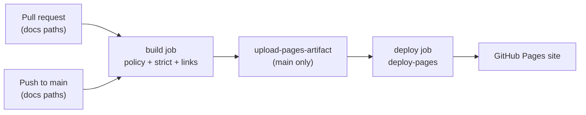

# Publishing Documentation

The documentation site is built with [MkDocs Material](https://squidfunk.github.io/mkdocs-material/) and deployed to GitHub Pages by the [Deploy docs](https://github.com/Ndevu12/Research_Assistant_Model/blob/main/.github/workflows/docs.yml) workflow.

**Published URL:** https://ndevu12.github.io/Research_Assistant_Model/

## One-time repository setup

Before the first deploy succeeds, configure GitHub Pages in the repository settings:

1. Open **Settings → Pages**.
2. Set **Build and deployment → Source** to **GitHub Actions** (not “Deploy from a branch”).
3. Merge documentation changes into `main`; the workflow deploys only from that branch.

After the first successful run, the site is available at the URL above. Optionally:

- Add the docs URL to the repository **About** section (Website field).
- Add a docs badge or link in the root [README](https://github.com/Ndevu12/Research_Assistant_Model/blob/main/README.md).

## When deployments run

The workflow triggers on:

- **Push to `main`** when files under `docs/`, `mkdocs.yml`, or `.github/workflows/docs.yml` change.
- **Manual dispatch** via **Actions → Deploy docs → Run workflow**.

Feature branches do not deploy. Validate changes locally or open a PR — the docs workflow runs the same checks without deploying.

## Local preview and build

Install dev dependencies and serve the site locally:

```bash
pipenv install --dev
pipenv run mkdocs serve
# → http://127.0.0.1:8000/Research_Assistant_Model/
```

Build without serving (same check CI uses):

```bash
NO_MKDOCS_2_WARNING=1 pipenv run mkdocs build --strict
pipenv run python scripts/check_docs_policy.py
```

The `--strict` flag turns warnings into errors. Fix any reported issues before pushing doc changes.

Material for MkDocs prints an informational banner about upcoming MkDocs 2.0 incompatibilities. This project stays on MkDocs 1.x for now; set `NO_MKDOCS_2_WARNING=1` (as in CI) to suppress that banner during local builds.

## Pull request validation

The [Deploy docs](https://github.com/Ndevu12/Research_Assistant_Model/blob/main/.github/workflows/docs.yml) workflow also runs on **pull requests** that touch `docs/`, `mkdocs.yml`, or `contributing.md`. PR jobs build but do **not** deploy.

| Check | Purpose |
|-------|---------|
| `scripts/check_docs_policy.py` | Rejects scaffold placeholders, duplicate `docs/contributing.md`, missing canonical markers, and forbidden duplicate command blocks (see [Canonical sources](../reference/canonical-sources.md)) |
| `mkdocs build --strict` | Fails on broken nav, missing pages, or MkDocs warnings |
| `linkchecker` | Validates internal links in the built `site/` |

Feature branches do not deploy. Merge to `main` to publish.

## CI workflow overview



| Job | Purpose |
|-----|---------|
| `build` | Policy check, `mkdocs build --strict`, link validation; uploads artifact on `main` only |
| `deploy` | Publishes the artifact to the `github-pages` environment (push to `main` only) |

Build dependencies are installed with `pip` in CI (not Pipenv) for a fast, docs-only job. Local development still uses the versions pinned in `Pipfile` under `[dev-packages]`.

## Troubleshooting deploys

| Symptom | Likely cause | Fix |
|---------|--------------|-----|
| Workflow does not run | Change was not on `main` or outside watched paths | Merge to `main` or use workflow dispatch |
| `build` fails on `--strict` | Broken nav link, missing page, or MkDocs warning | Run `pipenv run mkdocs build --strict` locally and fix warnings |
| `build` fails on policy check | Scaffold marker, thin/duplicate page, or forbidden command duplication | Run `pipenv run python scripts/check_docs_policy.py`; see [Canonical sources](../reference/canonical-sources.md) |
| `build` fails on link check | Broken internal doc link | Rebuild and run `linkchecker site/index.html` locally |
| `deploy` fails or site is 404 | Pages source not set to GitHub Actions | Check **Settings → Pages → Source** |
| Broken assets or wrong base URL | `site_url` mismatch | Ensure `site_url` in `mkdocs.yml` ends with `/Research_Assistant_Model/` |

See also: [Contributing to Documentation](https://github.com/Ndevu12/Research_Assistant_Model/blob/main/contributing.md) for writing conventions and [Local setup](local-setup.md) for the full dev environment.
