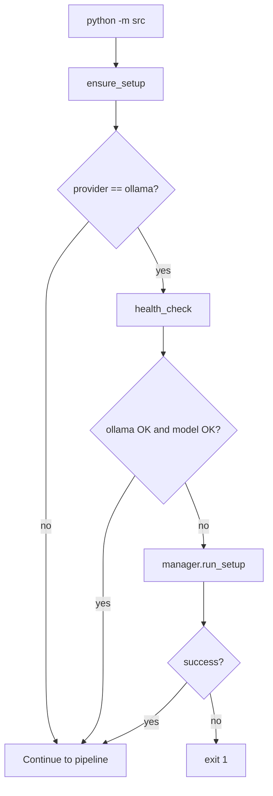

# Health Check

## Commands

Setup commands (health check, manager, model pin): [Setup system — Quick start](../setup-system/index.md#quick-start).

Copy-paste install steps: [README Setup & health check](https://github.com/Ndevu12/Research_Assistant_Model#setup--health-check).

To override the model for a one-off check, see [Setup system — Module reference](../setup-system/index.md#health_checkpy) (`--model` flag).

## What `health_check` validates

Source: `setups/health_check.py`

| Check | Function | Pass criteria |
|-------|----------|---------------|
| Pipenv available | `check_python_deps()` | `pipenv` on PATH, `aiohttp` importable |
| Embedding deps | `check_embedding_deps()` | `sentence-transformers` importable |
| Ollama binary | `check_ollama_installed()` | `ollama` on PATH |
| Ollama server | `check_ollama_running()` | `ollama list` succeeds (5s timeout) |
| Model | `check_model_available()` | Resolved model exists locally |

Model resolution uses `resolve_target_model()` from `src/config/model_selection.py`:

- Reads `RA_LLM__MODEL` (default `auto`)
- When `auto`, picks best fit from `config/ollama_models.yaml` based on RAM/disk
- Validates against installed Ollama models via `ollama list`

Override the resolved model for a check: see [Setup system](../setup-system/index.md#health_checkpy) (`health_check --model …`).

## Integration with CLI startup

Every `python -m src` invocation runs `ensure_setup()` first (`src/__main__.py`):

1. If provider ≠ `ollama` → skip setup, return success
2. Run `health_check.check_ollama_running()` + `check_model_available()`
3. If both pass → proceed
4. Else → print health report → `manager.run_setup()` → abort if setup fails

This is why first-run can take several minutes (Ollama install + model pull).

## Reading the report

`health_check.print_report()` prints a human-readable status for each check. Overall success requires embedding deps + (for Ollama) running server + installed model.

Common failure messages:

| Message | Action |
|---------|--------|
| `sentence-transformers not installed` | `pipenv install` |
| `Ollama server is not running` | [Setup system](../setup-system/index.md#quick-start) or `ollama serve` |
| `Model '…' not installed` | [Setup system](../setup-system/index.md#quick-start) or `ollama pull <model>` |
| `pipenv not installed` | Install Pipenv, run from project root |

## Cloud provider note

When `RA_LLM__PROVIDER` is `openai` or `anthropic`, CLI setup checks are skipped. Set provider and API keys per [Cloud providers](../llm/cloud-providers.md), then run a query using [README Usage](https://github.com/Ndevu12/Research_Assistant_Model#usage).

## Troubleshooting

See [Troubleshooting](../operations/troubleshooting.md) for expanded FAQ.

See also: [Installation](installation.md), [Quick start](quick-start.md), [Ollama](../llm/ollama.md).
