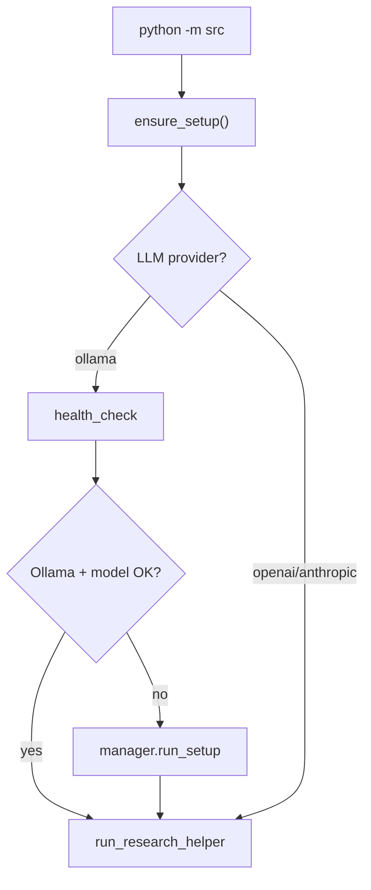

# Quick Start

## Commands

Install and run your first query: [README Quick Start](https://github.com/Ndevu12/Research_Assistant_Model#quick-start).

CLI flags and output formats: [README Usage](https://github.com/Ndevu12/Research_Assistant_Model#usage) and [CLI reference](../user-guide/cli.md).

Always use **`pipenv run`** — plain `python -m src` may miss dependencies (see [Troubleshooting](../operations/troubleshooting.md)).

## What runs internally

### 1. CLI entry (`src/__main__.py`)

```
python -m src "query"
    → main()
    → ensure_setup()
    → run_research_helper(query)
```

### 2. Setup gate (`ensure_setup()`)

When `RA_LLM__PROVIDER=ollama` (default):

1. Warn if not inside Pipenv (`PIPENV_ACTIVE != 1`)
2. Import `setups/health_check.py` and `setups/manager.py`
3. Check Ollama server + resolved model via `health_check`
4. If incomplete → print report → run `manager.run_setup()` (install/start Ollama, pull model)

Cloud providers (`openai`, `anthropic`) **skip** Ollama setup entirely.



### 3. Research helper (`run_research_helper`)

Batch CLI queries use a **shortcut settings override**:

- Providers: **OpenAlex + Semantic Scholar only** (YAML toggles ignored)
- Limit: 8 papers per provider per query variant (default)
- Pipeline: full 11 stages via `build_pipeline()` → `ResearchPipeline.execute()`

Interactive mode (`python -m src` with no query) uses `InteractiveResearchSession` → `run_research_with_result()` with **full** `AppSettings` (all enabled providers from config).

### 4. Pipeline execution

```
run_research_with_result()
    → resolve_effective_settings()   # LLM feature flags
    → PipelineProgressReporter       # stderr progress (TTY)
    → build_pipeline()               # 11 stages
    → pipeline.execute(query)
    → render_report_output()         # markdown/json/html/pdf
```

Stages run sequentially: query understanding → expansion → retrieval → dedup → ranking → relevance → clustering → synthesis → gap analysis → citations → report.

See [Architecture overview](../architecture/overview.md).

## First-run timeline (Ollama default)

| Step | What happens |
|------|----------------|
| 1 | Pipenv deps already installed |
| 2 | Ollama installed/started if missing |
| 3 | Model resolved (`auto` → `llama3.1:8b` or `llama3.2:3b` from catalog) |
| 4 | Model pulled if not local |
| 5 | Embedding model downloaded on first embedding stage |
| 6 | Scholarly APIs queried; report printed to stdout |

Progress appears on stderr unless `--no-progress` or non-TTY.

## Default quality profile

Out of the box, the pipeline runs **heuristic synthesis** and **heuristic query expansion** (`llm_enabled: false`). Reports are fast and work offline after model download, but cross-paper synthesis is template-driven rather than LLM-authored.

Enable LLM stages and copy-paste env recipes: [Heuristic vs LLM](../llm/heuristic-vs-llm.md) and [Configuration cookbook](../user-guide/configuration-cookbook.md).

## After your first query

| Goal | Next page |
|------|-----------|
| Validate setup | [Health check](health-check.md) |
| CLI flags and formats | [CLI reference](../user-guide/cli.md) |
| Enable arXiv / CrossRef | [Configuration cookbook](../user-guide/configuration-cookbook.md) |
| Debug a partial run | [Logging and debug](../operations/logging-and-debug.md) |
