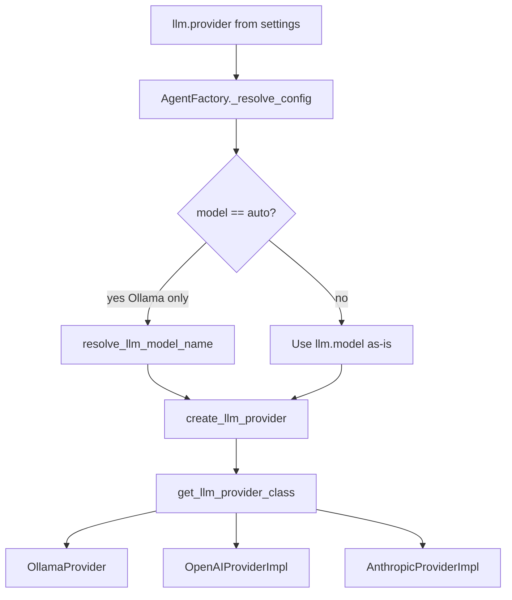

# Cloud Providers

OpenAI and Anthropic are supported as cloud LLM backends. Both use pydantic-ai model wrappers and share the same `AgentFactory` / role system as Ollama.

Source: `src/models/openai.py`, `src/models/anthropic.py`, `src/models/factory.py`.

## When to use cloud providers

| Scenario | Recommendation |
|----------|----------------|
| No local GPU/RAM for 8B+ models | OpenAI (`gpt-4o-mini`) or Anthropic (`claude-3-5-haiku-latest`) |
| Maximum synthesis quality | Cloud + explicit `RA_SYNTHESIS__LLM_ENABLED=true` |
| Offline / privacy-sensitive work | Stay on [Ollama](ollama.md) |
| Cost-sensitive batch runs | Heuristic mode or smaller cloud models |

!!! tip "Auto-enables LLM stages"
    With `llm_mode: auto`, **OpenAI and Anthropic always enable** synthesis and query expansion LLM — unlike Ollama, which follows catalog hints. See [Heuristic vs LLM](heuristic-vs-llm.md).

## OpenAI

### Configuration

```bash
RA_LLM__PROVIDER=openai
RA_LLM__MODEL=gpt-4o-mini
OPENAI_API_KEY=sk-...
```

**YAML equivalent:**

```yaml
llm:
  provider: openai
  model: gpt-4o-mini
  # base_url optional — defaults to https://api.openai.com
```

| Variable | Required | Notes |
|----------|----------|-------|
| `OPENAI_API_KEY` | **Yes** | Primary key source |
| `RA_LLM__API_KEY` | No | Overrides provider-specific key when set |
| `RA_LLM__BASE_URL` | No | OpenAI-compatible proxy (LM Studio, Azure OpenAI-style endpoints) |

### Base URL behavior

`OpenAIProviderImpl` (`src/models/openai.py`):

- Empty base URL or Ollama default (`http://localhost:11434`) → `https://api.openai.com/v1`
- Custom base URL → normalized with `/v1` suffix

Use a custom base URL for OpenAI-compatible gateways:

```bash
RA_LLM__PROVIDER=openai
RA_LLM__MODEL=your-model-name
RA_LLM__BASE_URL=https://your-gateway.example.com
RA_LLM__API_KEY=your-key
```

Missing API key raises at model creation:

```
OpenAI provider requires an API key. Set RA_LLM__API_KEY or OPENAI_API_KEY.
```

## Anthropic

### Configuration

```bash
RA_LLM__PROVIDER=anthropic
RA_LLM__MODEL=claude-3-5-haiku-latest
ANTHROPIC_API_KEY=sk-ant-...
```

**YAML equivalent:**

```yaml
llm:
  provider: anthropic
  model: claude-3-5-haiku-latest
```

| Variable | Required | Notes |
|----------|----------|-------|
| `ANTHROPIC_API_KEY` | **Yes** | Primary key source |
| `RA_LLM__API_KEY` | No | Unified override |

Anthropic uses pydantic-ai's native Anthropic model — no custom base URL normalization beyond what pydantic-ai provides.

## API key resolution order

All providers check keys through `resolve_api_key()` in `src/models/base.py`:

| Priority | Source |
|----------|--------|
| 1 | `RA_LLM__API_KEY` (from settings / env) |
| 2 | Provider env var (`OPENAI_API_KEY`, `ANTHROPIC_API_KEY`, `OLLAMA_API_KEY`) |
| 3 | Ollama only: default `"ollama"` |

Full env reference: [Environment variables](../configuration/environment-variables.md).

## Provider selection flow



!!! warning "auto model with cloud providers"
    `llm.model: auto` resolves via `ollama_models.yaml` — meaningful for Ollama only. Set an explicit cloud model name (`gpt-4o-mini`, `claude-3-5-haiku-latest`, etc.).

## Registering a custom provider

Extend the built-in registry for OpenAI-compatible or custom backends:

```python
from src.models.base import LLMProvider
from src.models.factory import register_llm_provider

class MyProvider(LLMProvider):
    name = "my_provider"

    def create_model(self, config):
        ...

register_llm_provider(MyProvider)
```

Then set `RA_LLM__PROVIDER=my_provider`. See [Extensibility](../development/extensibility.md).

## Example recipes

**High-quality cloud run:** [Configuration cookbook — Cloud OpenAI](../user-guide/configuration-cookbook.md#3-cloud-openai-quality).

**Anthropic with explicit LLM modes:**

```bash
RA_LLM__PROVIDER=anthropic
RA_LLM__MODEL=claude-3-5-haiku-latest
ANTHROPIC_API_KEY=sk-ant-...
RA_SYNTHESIS__LLM_MODE=on
RA_QUERY_EXPANSION__LLM_MODE=on
```

More recipes: [Configuration cookbook](../user-guide/configuration-cookbook.md).

## Known limitations

| Setting | Status |
|---------|--------|
| `llm.temperature` | Defined in config; **not passed** to pydantic-ai constructors |
| `llm.timeout_seconds` | Defined in config; stage timeouts use pipeline settings |
| `llm.model: auto` | Ollama catalog only — use explicit names for cloud |

## Related pages

- [Ollama](ollama.md) — local default provider
- [LLM layer](../architecture/llm-layer.md) — agent roles and call sites
- [Heuristic vs LLM](heuristic-vs-llm.md) — cloud auto-enables LLM stages
