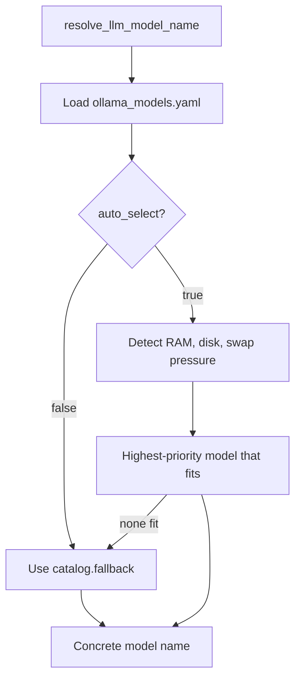

# Ollama

Ollama is the **default LLM provider**. The application talks to a local Ollama server through its OpenAI-compatible API (`/v1/chat/completions`) via pydantic-ai.

Source: `src/models/ollama.py`, `src/config/model_selection.py`, `config/ollama_models.yaml`, `setups/ollama.py`.

## Quick setup

Setup commands (manager, health check, model pin): [Setup system — Quick start](../setup-system/index.md#quick-start).

Check matrix and reading the report: [Health check](../getting-started/health-check.md).

The setup system reads the same catalog as runtime auto-selection.

## Configuration

| Setting | Default | Env override |
|---------|---------|--------------|
| Provider | `ollama` | `RA_LLM__PROVIDER=ollama` |
| Model | `auto` | `RA_LLM__MODEL=llama3.1:8b` |
| Base URL | `http://localhost:11434` | `RA_LLM__BASE_URL` |
| API key | placeholder `"ollama"` | `RA_LLM__API_KEY` or `OLLAMA_API_KEY` |

**YAML** (`config/default.yaml` or overlay):

```yaml
llm:
  provider: ollama
  model: auto
  base_url: http://localhost:11434
```

!!! info "Base URL normalization"
    `normalize_openai_base_url()` appends `/v1` when missing. Both `http://localhost:11434` and `http://localhost:11434/v1` resolve to the same endpoint. See [Environment variables](../configuration/environment-variables.md).

## Model catalog (`config/ollama_models.yaml`)

The catalog drives **setup auto-selection**, **health checks**, and **LLM feature hints** when `llm.model` is `auto`.

```yaml
auto_select: true
fallback: llama3.2:3b

models:
  - name: llama3.1:8b
    label: Llama 3.1 8B
    min_ram_gb: 8
    recommended_ram_gb: 10
    disk_gb: 5
    priority: 100
    synthesis:
      llm_enabled: true
      max_llm_papers: 5

  - name: llama3.2:3b
    label: Llama 3.2 3B
    min_ram_gb: 4
    recommended_ram_gb: 6
    disk_gb: 2.5
    priority: 50
    synthesis:
      llm_enabled: false
      max_llm_papers: 3
```

| Field | Purpose |
|-------|---------|
| `priority` | Higher wins when multiple models fit resources |
| `min_ram_gb` / `disk_gb` | Hard requirements for auto-select |
| `recommended_ram_gb` | Used in setup logging and health-check warnings |
| `synthesis.llm_enabled` | Hint for `llm_mode: auto` (see [Heuristic vs LLM](heuristic-vs-llm.md)) |
| `synthesis.max_llm_papers` | Applied to synthesis config when model resolves |

Override the catalog directory with `RA_CONFIG_DIR` if you maintain a custom copy.

## Auto-selection algorithm

When `llm.model` is `auto` or empty, `resolve_llm_model_name()` in `src/config/model_selection.py`:



**Resource detection:**

| OS | RAM source | Disk |
|----|------------|------|
| Linux | `/proc/meminfo` (MemTotal, MemAvailable, swap) | `shutil.disk_usage` on config dir |
| macOS | `sysctl hw.memsize`, `vm_stat` | Same |
| Other | Conservative fallback values | Same |

**Swap pressure** can downgrade selection when swap is heavily used. Explicit model names (CLI `--model`, env, or YAML) skip auto-selection entirely.

**Model source priority** (when resolving target model for setup):

1. CLI `--model` argument
2. `RA_LLM__MODEL` env var
3. YAML `llm.model`
4. Catalog auto-select (or `fallback`)

## Setup integration

`setups/ollama.py` shares `resolve_target_model()` with runtime resolution:

| Command | Behavior |
|---------|----------|
| `python -m setups.ollama install` | OS-aware Ollama binary install (Linux script, Homebrew, Arch pacman/yay) |
| `python -m setups.ollama setup` | Start server if needed, resolve model, `ollama pull` if missing |
| `python -m setups.manager` | Full pipeline: deps → Ollama install → model setup |

After setup, if the selected catalog entry has `synthesis.llm_enabled: true`, setup logs a tip to set `RA_SYNTHESIS__LLM_ENABLED=true`.

## LLM feature resolution (Ollama-specific)

At pipeline start, `resolve_effective_settings()` resolves the concrete model name, then applies `llm_mode: auto` rules:

| Resolved model | `llm_mode: auto` → synthesis | `llm_mode: auto` → query expansion |
|----------------|------------------------------|-------------------------------------|
| `llama3.1:8b` | **On** (catalog hint) | **On** (same hint) |
| `llama3.2:3b` | **Off** | **Off** |

Force behavior regardless of catalog:

```bash
RA_SYNTHESIS__LLM_ENABLED=true
RA_QUERY_EXPANSION__LLM_ENABLED=true
# or
RA_SYNTHESIS__LLM_MODE=on
RA_QUERY_EXPANSION__LLM_MODE=on
```

Env `RA_SYNTHESIS__LLM_ENABLED` / `RA_QUERY_EXPANSION__LLM_ENABLED` override `llm_mode` entirely.

## Provider implementation

`OllamaProvider` (`src/models/ollama.py`) wraps pydantic-ai's `OpenAIChatModel` pointed at the normalized base URL. No cloud API key is required; the server ignores the placeholder key.

Agents are created per role at call time via `AgentFactory` — see [LLM layer](../architecture/llm-layer.md) for roles (EXPANSION, EXTRACTION, SYNTHESIS, GAP_ANALYSIS).

## Troubleshooting

| Symptom | Check |
|---------|-------|
| `Connection refused` on LLM calls | `ollama list` — start with `ollama serve` or re-run setup |
| Wrong model selected | [Setup system](../setup-system/index.md#quick-start) — review RAM/disk in health check output |
| LLM stages skipped | 3B fallback + `llm_mode: auto` disables LLM; pin 8B or set `RA_SYNTHESIS__LLM_ENABLED=true` |
| Catalog not found | Ensure `config/ollama_models.yaml` exists or set `RA_CONFIG_DIR` |

## Related pages

- [Heuristic vs LLM](heuristic-vs-llm.md) — when catalog hints enable LLM stages
- [Cloud providers](cloud-providers.md) — switch away from Ollama
- [Configuration cookbook](../user-guide/configuration-cookbook.md) — copy-paste recipes
- [LLM layer](../architecture/llm-layer.md) — full resolution pipeline
