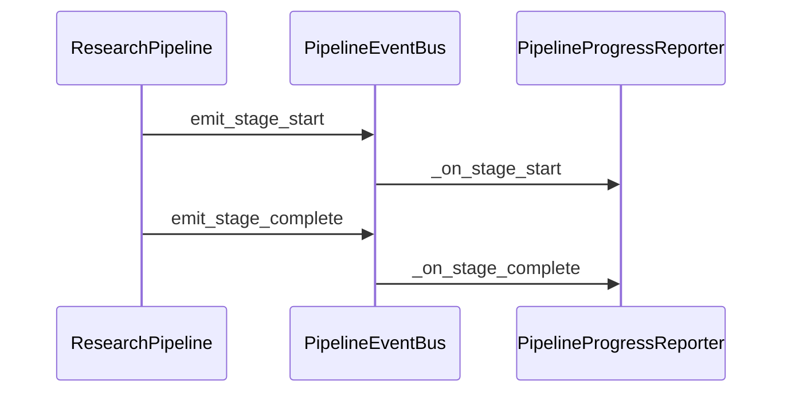

# Progress Streaming

During pipeline runs, the CLI can show live progress on **stderr**: stage checkmarks, sub-activities, and streaming LLM token previews.

Source: `src/utils/progress_reporter.py`, wired in `run_research_with_result()` (`src/retrieval/orchestrator.py`).

## What you see

When stderr is a TTY, `PipelineProgressReporter` renders a Rich live display:

1. **Query header** — the research question
2. **Progress bar** — stages completed / 11 total
3. **Current stage label** — e.g. "Retrieving papers from scholarly APIs…"
4. **Sub-activity** — e.g. "Analyzing paper 2/5" (cyan italic line)
5. **LLM preview panel** — trailing tokens during agent streaming ("AI generating…")
6. **Per-stage lines** — ✓ or ⚠ with duration in ms when each stage completes
7. **Summary** — `Pipeline complete` or `Pipeline partial` with total time

### Stage labels

| Stage key | Display label |
|-----------|---------------|
| `query_understanding` | Understanding your question |
| `query_expansion` | Expanding search queries |
| `retrieval` | Retrieving papers from scholarly APIs |
| `deduplication` | Removing duplicate papers |
| `ranking` | Ranking papers by relevance |
| `relevance_scoring` | Scoring semantic relevance |
| `clustering` | Grouping papers by theme |
| `synthesis` | Synthesizing cross-paper insights |
| `gap_analysis` | Identifying research gaps |
| `citation_export` | Formatting citations |
| `report_generation` | Organizing final report |

## Enabling and disabling

| Method | Effect |
|--------|--------|
| Default | Enabled when `RA_PIPELINE__STREAM_PROGRESS=true` (default) |
| CLI flag | `--no-progress` disables for one run |
| Env | `RA_PIPELINE__STREAM_PROGRESS=false` |
| Non-TTY stderr | Automatically disabled (e.g. piped output, CI logs) |

```bash
# Disable for this run
pipenv run python -m src --no-progress "your query"

# Disable globally
export RA_PIPELINE__STREAM_PROGRESS=false
```

## Event bus integration

The reporter subscribes to `PipelineEventBus` stage lifecycle events:



Stages call `set_activity()` / `set_llm_preview()` during long operations (especially synthesis). LLM calls use `stream_agent_text()` which delegates to `stream_agent_response()` when a reporter is active.

## Context variable

The active reporter is stored in a `ContextVar` (`get_progress_reporter()` / `set_progress_reporter()`). Nested async tasks in the same pipeline run share one reporter instance.

## API and non-CLI runs

`run_research_with_result(..., stream_progress=True)` accepts an explicit override. FastAPI handlers can pass `stream_progress=false` for silent server-side runs.

Interactive mode respects the same `--no-progress` flag passed at CLI startup.

## Partial runs

A stage marked **partial** (timeout, provider failure, heuristic recovery) shows ⚠ instead of ✓. The final summary line reads `Pipeline partial` in yellow.

See also: [Logging and debug](logging-and-debug.md), [CLI reference](../user-guide/cli.md), [Architecture overview](../architecture/overview.md).
