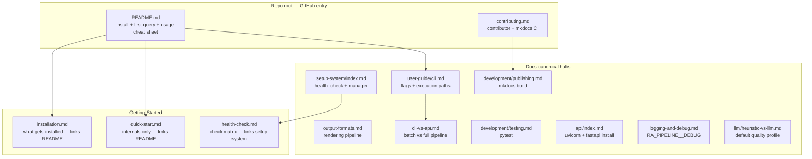

<!-- canonical: registry -->

# Canonical Sources

Every **copy-paste command block** and **repeated conceptual warning** lives in one canonical place. All other pages **link** to it — like [docs/contributing.md](../contributing.md) does for the root [contributing.md](https://github.com/Ndevu12/Research_Assistant_Model/blob/main/contributing.md).

This page is the registry for contributors. When you add or move documentation, check here first so commands and warnings are not duplicated across nav pages.

## Domain hubs

Canonical content is organized by topic hub, not a single mega commands page:



## Authoritative map

| Content | Canonical location | Everywhere else |
|---------|-------------------|-----------------|
| Install + first query | [README.md](https://github.com/Ndevu12/Research_Assistant_Model#quick-start) | Link to `#quick-start` / `#usage` anchors |
| Install context (packages, layout) | [getting-started/installation.md](../getting-started/installation.md) | Link to README for bash blocks |
| First-run internals | [getting-started/quick-start.md](../getting-started/quick-start.md) | No repeated usage cheat sheet |
| Setup / health / manager | [setup-system/index.md](../setup-system/index.md) | One-liner + link |
| Health check matrix | [getting-started/health-check.md](../getting-started/health-check.md) | Link to setup-system for commands |
| CLI flags and execution paths | [user-guide/cli.md](../user-guide/cli.md) | Flag table + **unique** examples only; no full README block |
| Output format rendering | [user-guide/output-formats.md](../user-guide/output-formats.md) | Link to README for `--format` commands |
| CLI vs API / provider divergence | [user-guide/cli-vs-api.md](../user-guide/cli-vs-api.md) | Admonition + link; no re-explanation |
| Default heuristic quality | [llm/heuristic-vs-llm.md](../llm/heuristic-vs-llm.md) | Short admonition + link |
| pytest | [development/testing.md](../development/testing.md) | Link only |
| API server | [api/index.md](../api/index.md) | Link only |
| MkDocs / publish / policy check | [development/publishing.md](../development/publishing.md) + root [contributing.md](https://github.com/Ndevu12/Research_Assistant_Model/blob/main/contributing.md) | Link only |
| Debug mode | [operations/logging-and-debug.md](../operations/logging-and-debug.md) | Link from troubleshooting |
| Contributor entry | Root [contributing.md](https://github.com/Ndevu12/Research_Assistant_Model/blob/main/contributing.md) | [docs/contributing.md](../contributing.md) = pointer only |
| Setup stub | [setups/README.md](https://github.com/Ndevu12/Research_Assistant_Model/blob/main/setups/README.md) | 3 commands + docs links (keep as-is) |

## Reference pattern

Replace duplicated blocks with links. This pattern is already used in [installation.md](../getting-started/installation.md):

```markdown
## Commands

Copy-paste steps: [README Quick Start](https://github.com/Ndevu12/Research_Assistant_Model#quick-start).

## [Topic-specific section — unique to this page]
```

For in-site links (MkDocs):

```markdown
Setup commands: [Setup system](../setup-system/index.md#quick-start).
```

Use **stable headings** (`## Quick start`, `## Commands`) as link anchors on canonical pages.

## What not to duplicate

- Full README usage blocks (4+ lines of `python -m src`) — [README Usage](https://github.com/Ndevu12/Research_Assistant_Model#usage) only
- Setup health/manager command trio — [setup-system/index.md](../setup-system/index.md) (+ README + setups stub)
- `pipenv run mkdocs serve` — [contributing.md](https://github.com/Ndevu12/Research_Assistant_Model/blob/main/contributing.md) and [publishing.md](../development/publishing.md) only
- `pipenv run pytest` blocks — [contributing.md](https://github.com/Ndevu12/Research_Assistant_Model/blob/main/contributing.md) and [testing.md](../development/testing.md) only

!!! tip "Context-specific one-liners are OK"
    Cookbooks and troubleshooting may include a single command when it is recipe- or symptom-specific. Remove only **full duplicate cheat sheets**, not unique examples.

## CI enforcement

Pull requests run `scripts/check_docs_policy.py` alongside `mkdocs build --strict`. The script rejects forbidden duplicate command signatures outside their allowed files. See [Publishing documentation](../development/publishing.md) for details.
