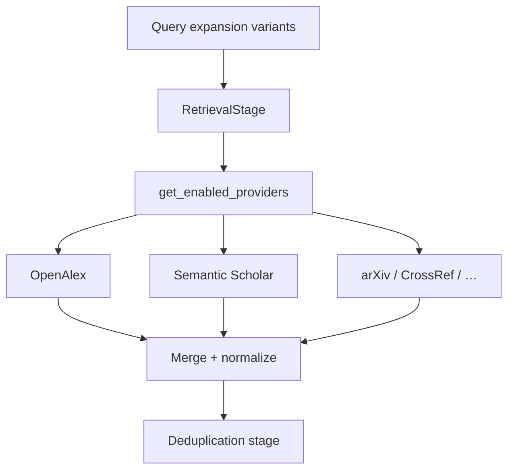

# Retrieval Overview

The retrieval layer searches multiple scholarly APIs in parallel, normalizes responses into `RetrievedPaper` objects, and feeds the embedding-backed pipeline stages.

Source: `src/retrieval/providers/`, `src/retrieval/retrieval_stage.py`, `src/retrieval/orchestrator.py`.

## Architecture



1. **Registry** — `get_enabled_providers(settings)` iterates `settings.retrieval.providers`, skips disabled names, instantiates classes from `_PROVIDER_CLASSES` (`registry.py`).
2. **Concurrency** — For each expanded query variant, all enabled providers run in parallel via `asyncio.gather`. A semaphore caps total concurrent searches at `retrieval.concurrency_limit` (default 4).
3. **Limits** — Each provider receives `settings.retrieval.per_provider_limit` (default 8). Per-provider `limit` in YAML is **not** used.
4. **Failure handling** — `_safe_search()` catches exceptions per provider → warning log + empty list. The stage is marked **partial** if any provider fails.
5. **Cache bypass** — When `memory.cache_enabled=true` and a cache hit exists, `cached_papers` is passed as an initial artifact and network retrieval is skipped.

## CLI vs full pipeline

!!! info "CLI vs full pipeline"
    `python -m src "query"` calls `run_research_helper()`, which **hardcodes** OpenAlex + Semantic Scholar only. YAML provider toggles are ignored for the provider set.

| Aspect | Full pipeline (`run_research` / API) | CLI batch (`run_research_helper`) |
|--------|--------------------------------------|-----------------------------------|
| Entry | API, interactive session, programmatic | `python -m src "query"` |
| Settings | Full `AppSettings()` merge | Constructor override replaces `providers` dict |
| Providers | All `enabled=true` in config | OpenAlex + Semantic Scholar only |
| Limit | `per_provider_limit` (default 8) | `k_each` param (default 8) |
| arXiv / CrossRef | Honored when enabled in YAML/env | **Not available** |

To use additional providers from the CLI path today, use **interactive mode**, the **API**, or call `run_research()` programmatically. See [CLI vs API](../user-guide/cli-vs-api.md) and [Provider matrix](provider-matrix.md).

```python
# orchestrator.py — CLI helper override
settings = AppSettings(
    retrieval={
        "per_provider_limit": k_each,
        "providers": {
            "openalex": {"enabled": True, "limit": k_each},
            "semantic_scholar": {"enabled": True, "limit": k_each},
        },
    }
)
```

Interactive mode (`python -m src` with no query arg) uses the **full pipeline** via `InteractiveResearchSession.run_full_query()` → `run_research_with_result()`.

## HTTP client

- Library: **aiohttp** (`ClientSession` created in `RetrievalStage`)
- Search timeout: **60 seconds** per request
- Health check timeout: **15 seconds**
- Retries: **3** attempts with exponential backoff (`2 ** attempt` seconds)
- Rate limits: Semantic Scholar and CrossRef honor HTTP **429** + `Retry-After` header

## Enabling providers

**YAML** (`config/providers.yaml`):

```yaml
providers:
  arxiv:
    enabled: true
  crossref:
    enabled: true
```

**Environment:**

```bash
RA_RETRIEVAL__PROVIDERS__ARXIV__ENABLED=true
RA_RETRIEVAL__PROVIDERS__CROSSREF__ENABLED=true
RA_CROSSREF_MAILTO=you@example.com
S2_API_KEY=optional_key_for_higher_limits
```

**Programmatic:**

```python
from src.config.settings import AppSettings
from src.retrieval.orchestrator import run_research

settings = AppSettings(
    retrieval={"providers": {"arxiv": {"enabled": True}}}
)
report = await run_research("transformer attention", settings=settings)
```

## Extensibility

Custom providers register via `register_provider(name, class)` in `registry.py`. See [Extensibility](../development/extensibility.md) and `tests/test_phase3_extensibility.py`.

See also: [Provider matrix](provider-matrix.md), [Configuration — retrieval](../configuration/yaml-reference.md#retrieval), [Retrieval stage](../architecture/stages/retrieval.md).
