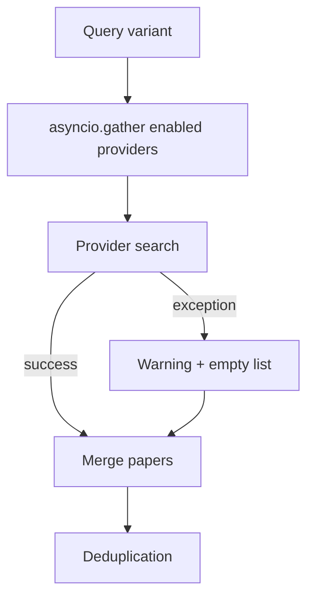

# Provider Matrix

Summary of all seven registered retrieval providers. HTTP details are in per-provider pages.

Source: `src/retrieval/providers/registry.py`, `_PROVIDER_CLASSES`.

## Status overview

| Key | Status | Default enabled | Auth | Notes |
|-----|--------|-----------------|------|-------|
| [openalex](per-provider/openalex.md) | **Live** | Yes | None | Used in CLI and full pipeline |
| [semantic_scholar](per-provider/semantic-scholar.md) | **Live** | Yes | `S2_API_KEY` (optional) | Used in CLI and full pipeline |
| [arxiv](per-provider/arxiv.md) | **Live** | No | None | Full pipeline / API only |
| [crossref](per-provider/crossref.md) | **Live** | No | Mailto in User-Agent (recommended) | Full pipeline / API only |
| `pubmed` | **Stub** | No | — | `NotImplementedError` if enabled |
| `core` | **Stub** | No | — | `NotImplementedError` if enabled |
| `dblp` | **Stub** | No | — | `NotImplementedError` if enabled |

!!! warning "Stub providers"
    PubMed, CORE, and DBLP are registered but not implemented. Enabling them raises `NotImplementedError` in `search()`, which `_safe_search()` catches — you get a warning and empty results for that provider, not a crash.

## Enable snippets

**OpenAlex + Semantic Scholar (defaults — no change needed):**

```yaml
# config/providers.yaml
providers:
  openalex:
    enabled: true
  semantic_scholar:
    enabled: true
```

**Add arXiv and CrossRef:**

```yaml
providers:
  arxiv:
    enabled: true
  crossref:
    enabled: true
```

```bash
RA_RETRIEVAL__PROVIDERS__ARXIV__ENABLED=true
RA_RETRIEVAL__PROVIDERS__CROSSREF__ENABLED=true
RA_CROSSREF_MAILTO=you@example.com
```

**Do not enable stubs:**

```yaml
# Will warn and return no papers from this provider
pubmed:
  enabled: true   # not recommended until implemented
```

## HTTP summary

| Provider | Method | Base endpoint | Search timeout | 429 handling |
|----------|--------|---------------|----------------|--------------|
| OpenAlex | GET | `https://api.openalex.org/works` | 60s | Retry only |
| Semantic Scholar | GET | `https://api.semanticscholar.org/graph/v1/paper/search/bulk` | 60s | Sleep `Retry-After` |
| arXiv | GET | `https://export.arxiv.org/api/query` | 60s | Retry only |
| CrossRef | GET | `https://api.crossref.org/works` | 60s | Sleep `Retry-After` |

All live providers: **3 retries**, exponential backoff, health ping at **15s** timeout.

## Config keys used at runtime

| Key | Default | Used? |
|-----|---------|-------|
| `retrieval.concurrency_limit` | `4` | Yes — caps parallel variant searches |
| `retrieval.per_provider_limit` | `8` | Yes — results per provider per variant |
| `retrieval.providers.<name>.enabled` | see table | Yes (full pipeline only) |
| `retrieval.providers.<name>.limit` | `8` | **No** — overridden by `per_provider_limit` |

## Graceful degradation



Partial retrieval (some providers failed) still proceeds through the pipeline. Check stderr warnings or enable debug dumps to inspect per-provider failures.

See also: [Retrieval overview](overview.md), [Environment variables](../configuration/environment-variables.md#retrieval-ra_retrieval__).
