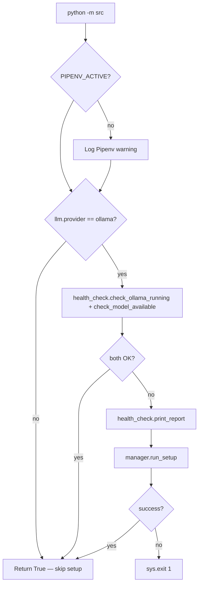

# Setup System

<!-- canonical: setup-commands -->

Automated setup for local Ollama inference: dependency checks, Ollama install, model pull, and health reporting. Cloud LLM providers (`openai`, `anthropic`) skip this path entirely.

Source: `setups/` package, invoked from `ensure_setup()` in `src/__main__.py`.

## Quick start

### Check setup status

```bash
pipenv run python -m setups.health_check
```

### Run full setup

```bash
pipenv run python -m setups.manager
```

### Run setup with a specific model

```bash
pipenv run python -m setups.manager --model llama3.1:8b
```

## How CLI startup uses setup

Every `python -m src` run calls `ensure_setup()` before the pipeline:



Implementation notes from `src/__main__.py`:

1. Adds `setups/` to `sys.path` and imports `health_check` + `manager` dynamically
2. Skips all Ollama checks when `RA_LLM__PROVIDER` is not `ollama`
3. On failure, runs `manager.run_setup()` automatically (first-run experience)
4. Exits with code `1` if auto-setup fails — user must run manager manually

See [Health check](../getting-started/health-check.md) for the check matrix.

## Manager orchestration

`manager.run_setup(model_name=None)` runs three steps in order (`setups/manager.py`):

| Step | Function | Purpose |
|------|----------|---------|
| Python Dependencies | `setup.install_python_deps()` | Ensures Pipenv deps (aiohttp, etc.) |
| Ollama Installation | `ollama.install_ollama()` | Downloads/installs Ollama binary if missing |
| Ollama Model Setup | `ollama.setup_ollama(model_name)` | Pulls and validates the target model |

Returns `True` only when all steps succeed. Logs a summary with the configured model name.

```bash
pipenv run python -m setups.manager
pipenv run python -m setups.manager --model mistral   # must be in ollama_models.yaml
```

## Module reference

### `health_check.py`

Validates runtime readiness. Used by CLI startup and manual diagnostics.

| Function | Checks |
|----------|--------|
| `check_python_deps()` | `pipenv` on PATH, `aiohttp` importable |
| `check_embedding_deps()` | `sentence-transformers` importable |
| `check_ollama_installed()` | `ollama` binary on PATH |
| `check_ollama_running()` | `ollama list` succeeds (5s timeout) |
| `check_model_available(model)` | Resolved model exists locally |

Model resolution uses `resolve_target_model()` from `src/config/model_selection.py`:

- Reads `RA_LLM__MODEL` (default `auto`)
- When `auto`, selects best fit from `config/ollama_models.yaml` based on RAM/disk
- Validates via `ollama list` and `is_model_installed()`

```bash
pipenv run python -m setups.health_check
pipenv run python -m setups.health_check --model llama3.1:8b
```

`print_report()` prints all checks and returns overall pass/fail.

### `setup.py`

Installs Python dependencies via Pipenv:

```bash
pipenv run python -m setups.setup
```

### `ollama.py`

Ollama binary and model management:

```bash
pipenv run python -m setups.ollama install
pipenv run python -m setups.ollama setup
pipenv run python -m setups.ollama setup --model llama3.2:3b
```

### `manager.py`

Orchestrates all setup steps. Entry point for full setup and CLI auto-recovery.

## Python API

```python
from setups import run_setup, print_report, check_ollama_running

is_running, message = check_ollama_running()
all_ok = print_report()
success = run_setup(model_name="llama3.2:3b")
```

Re-exports from `setups/__init__.py` for programmatic use in tests or custom tooling.

## Supported models

Catalog: `config/ollama_models.yaml`. Each entry defines RAM/disk requirements, priority, and optional feature flags (e.g. enabling LLM synthesis on 8B models).

```bash
# Auto-select (recommended)
pipenv run python -m setups.manager

# Force a supported model
pipenv run python -m setups.manager --model llama3.1:8b

# Or in .env (takes precedence over YAML defaults)
# RA_LLM__MODEL=llama3.1:8b
```

Auto-selection picks the highest-priority model that fits available RAM and disk. See [Ollama](../llm/ollama.md) for catalog details and `llm_mode` interaction.

## Logging

Setup operations log to `logs/`:

| File | Contents |
|------|----------|
| `combined_YYYYMMDD.log` | All log levels |
| `error_YYYYMMDD.log` | Errors and warnings |
| `events_YYYYMMDD.log` | Structured events |

```bash
tail -f logs/combined_*.log
```

Uses `src/utils/logging_system.py` — same logger as the research pipeline.

## Troubleshooting

### Setup fails with "pipenv not found"

```bash
pip install pipenv
cd /path/to/Research_Assistant_Model
pipenv install
```

### Setup fails with "Ollama not found"

Install from [ollama.com/download](https://ollama.com/download), then:

```bash
pipenv run python -m setups.manager
```

### Model pull fails

Check network and retry:

```bash
pipenv run python -m setups.ollama setup --model llama3.2:3b
```

### Embedding deps missing

```bash
pipenv install   # installs sentence-transformers from Pipfile
pipenv run python -m setups.health_check
```

### Cloud provider — setup skipped

When `RA_LLM__PROVIDER=openai` or `anthropic`, `ensure_setup()` returns immediately. Validate API keys separately — no Ollama required.

See also: [Health check](../getting-started/health-check.md), [Troubleshooting](../operations/troubleshooting.md), [Installation](../getting-started/installation.md).
