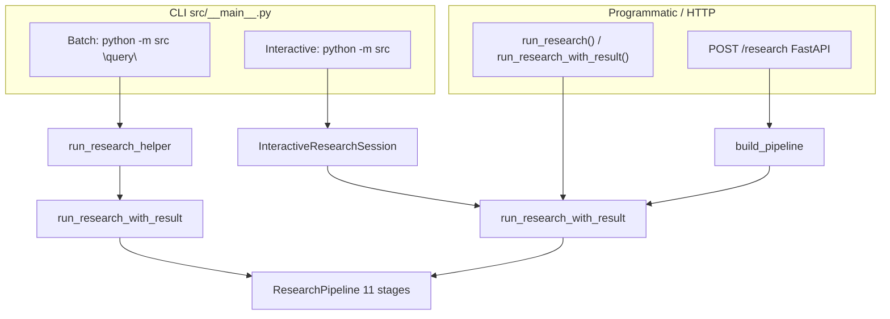

# CLI vs API — Execution Paths

The same research pipeline can be reached through four entry points. They differ in **which settings apply**, **which retrieval providers run**, and **how output is delivered**. This page is the authoritative comparison — use it when batch CLI behavior does not match your YAML config.

## Entry point map



| Entry | Source | Settings object | Provider set |
|-------|--------|-----------------|--------------|
| CLI batch | `run_research_helper()` | **Constructor override** — replaces `retrieval.providers` | OpenAlex + Semantic Scholar only |
| CLI interactive | `InteractiveResearchSession.run_full_query()` | Full `AppSettings()` merge | All `enabled: true` in config |
| Programmatic | `run_research()` / `run_research_with_result()` | Caller-supplied or default `AppSettings()` | All enabled in config |
| HTTP API | `build_pipeline(resolved_settings)` | `get_settings()` at app startup | All enabled in config |

!!! warning "Batch CLI ignores provider YAML"
    `run_research_helper()` builds a fresh `AppSettings` with only OpenAlex and Semantic Scholar. Env vars like `RA_RETRIEVAL__PROVIDERS__ARXIV__ENABLED=true` have **no effect** on `python -m src "query"`.

## Code trace — batch shortcut

Batch mode is the default when a positional query is provided:

```python
# src/__main__.py — batch path
asyncio.run(
    run_research_helper(
        args.query,
        output_format=output_format,
        export_formats=export_formats,
        output_path=getattr(args, "output", None),
        stream_progress=stream_progress,
    )
)
```

Inside the helper, settings are **hardcoded**:

```python
# src/retrieval/orchestrator.py — run_research_helper()
settings = AppSettings(
    retrieval={
        "per_provider_limit": k_each,
        "providers": {
            "openalex": {"enabled": True, "limit": k_each},
            "semantic_scholar": {"enabled": True, "limit": k_each},
        },
    }
)
report, result = await run_research_with_result(user_text, settings=settings, ...)
```

Everything else in `AppSettings` (LLM provider, synthesis mode, stage toggles, ranking weights) still comes from YAML/env — only the **provider dict** is replaced.

## Code trace — full pipeline

Interactive mode, the API, and programmatic calls use the merged settings:

```python
# InteractiveResearchSession.run_full_query()
report, pipeline_result = await run_research_with_result(
    query,
    settings=self.settings,  # AppSettings() — full merge
    session=self.session,
    store=self.store,
)

# FastAPI POST /research
pipeline = build_pipeline(resolved_settings)
result = await pipeline.execute(request.query)
```

`run_research_with_result()` always calls `build_pipeline(resolved_settings)` with whatever settings object was passed. Retrieval uses `get_enabled_providers(settings)` from the registry.

## Side-by-side comparison

| Aspect | CLI batch | CLI interactive | API | Programmatic |
|--------|-----------|-----------------|-----|--------------|
| Command / call | `python -m src "q"` | `python -m src` | `POST /research` | `await run_research(...)` |
| Pipeline stages | All 11 (if enabled in config) | All 11 | All 11 | All 11 |
| Retrieval providers | OA + S2 only | Config-enabled | Config-enabled | Config-enabled |
| `per_provider_limit` | `k_each` (default 8) | From config | From config | From config |
| Output delivery | stdout / `--output` | stdout per query | JSON response | Return value |
| Formats | markdown, json, html, pdf | Same | markdown, json, html only | Caller renders |
| Citation `--export` | After report on stdout | Startup flags + follow-up `export …` | `export` request field | Via `render_report_output` |
| Session memory | Not wired (see below) | SQLite + follow-ups | Not exposed | Optional `session`/`store` args |
| Progress | stderr (unless `--no-progress`) | stderr | Not streamed | Configurable |
| Setup gate | `ensure_setup()` always | Same | Not automatic | Caller responsibility |

## When to use which path

| Goal | Recommended path |
|------|------------------|
| Quick one-off query, default providers OK | CLI batch |
| Enable arXiv, CrossRef, or stub providers | Interactive, API, or programmatic |
| Follow-up filters without re-retrieval | CLI interactive |
| Integrate with another service | FastAPI or `run_research()` |
| Script JSON output | CLI batch `--format json` (OA+S2) or API |
| Validate provider config changes | Interactive or API — not batch CLI |

See [Configuration cookbook — Enable arXiv + CrossRef](configuration-cookbook.md#4-enable-arxiv-crossref-full-pipeline).

## `--session` flag (batch)

The CLI defines `--session` to enable SQLite memory in batch mode:

```bash
pipenv run python -m src --session "your query"
```

!!! warning "Not yet wired in __main__.py"
    As of the current codebase, `args.session` is parsed but **not passed** to `run_research_helper()`. Batch runs do not persist to SQLite despite the flag. Use **interactive mode** for session memory and follow-ups, or call `run_research_with_result(..., session=..., store=...)` programmatically.

## Output and rendering

All paths converge on `render_report_output()` in `src/reporting/output.py` for format-specific rendering. Differences:

- **CLI batch** — prints to stdout; writes `--output` file; appends `--export` blocks after the main report
- **Interactive** — prints each result; follow-ups re-render from cached `last_report`
- **API** — returns both `report` (JSON dict) and `rendered` (string or nested JSON) in the response body

See [Output formats](output-formats.md) for renderer details.

## Configuration that applies everywhere

These settings apply on **all** paths (including batch CLI), because they are not overridden by `run_research_helper()`:

- LLM provider and model (`RA_LLM__*`)
- Synthesis / query expansion mode (`RA_SYNTHESIS__*`, `RA_QUERY_EXPANSION__*`)
- Pipeline stage toggles (`RA_PIPELINE__ENABLED_STAGES__*`)
- Ranking and relevance weights
- Debug and progress flags (`RA_PIPELINE__DEBUG`, `RA_PIPELINE__STREAM_PROGRESS`)

Only **retrieval provider selection** differs on the batch shortcut.

## Programmatic example — full provider control

```python
import asyncio
from src.config.settings import AppSettings
from src.retrieval.orchestrator import run_research_with_result
from src.reporting.output import render_report_output

async def main():
    settings = AppSettings()  # loads YAML + env
    settings.retrieval.providers["arxiv"].enabled = True

    report, result = await run_research_with_result(
        "transformer attention mechanisms",
        settings=settings,
    )
    print(render_report_output(report, output_format="markdown", partial=result.partial))

asyncio.run(main())
```

## Related pages

- [CLI reference](cli.md) — flags and startup behavior
- [Interactive sessions](interactive-sessions.md) — follow-up commands and SQLite
- [API overview](../api/index.md) — install and response shape
- [Retrieval overview](../retrieval/overview.md) — provider registry and concurrency
- [Configuration cookbook](configuration-cookbook.md) — recipes per use case
