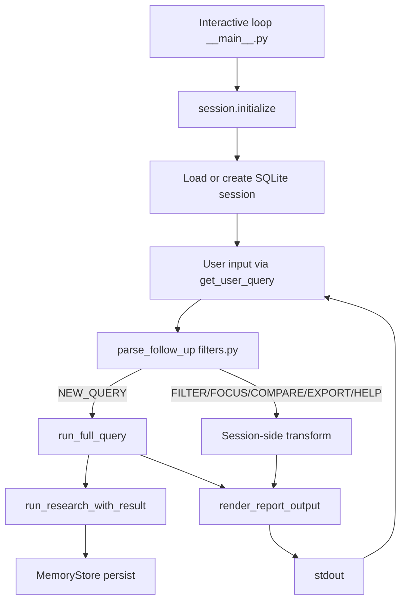

# Interactive Sessions

## Commands

Start interactive mode: [README Usage — interactive](https://github.com/Ndevu12/Research_Assistant_Model#usage) or [CLI reference](cli.md).

Session flags (`--format`, `--export`, `--no-progress`): [CLI reference — Arguments and flags](cli.md#arguments-and-flags).

!!! info "Batch `--session` flag"
    `python -m src --session "query"` is documented in the README but **not wired** in `__main__.py` as of current code. For SQLite memory and follow-ups, use interactive mode (no positional query). See [CLI vs API](cli-vs-api.md).

## Architecture

Implementation: `InteractiveResearchSession` in `src/memory/session.py`.



### Startup sequence

1. `run_interactive_mode()` prints welcome + `follow_up_help_text()`
2. Creates `InteractiveResearchSession()` with default `AppSettings()`
3. `initialize()` opens SQLite, loads existing session by ID or creates new
4. Restores `last_report` and `last_ranked_papers` from `session.context_json` if resuming

### Full pipeline runs

New research queries call `run_research_with_result()` with the **full** `AppSettings` merge — unlike batch CLI shortcut, **all enabled providers** in config are used.

```python
# src/memory/session.py
report, pipeline_result = await run_research_with_result(
    query,
    settings=self.settings,      # AppSettings() — not run_research_helper override
    session=self.session,
    store=self.store,
)
```

State persisted after each full run:

- `last_report` — `EnhancedResearchReport`
- `last_ranked_papers` — extracted from `pipeline_result.artifacts["ranked_papers"]`
- Session metadata in SQLite (`data/research.db` by default)

### Follow-up commands (no re-retrieval)

After the first query, `parse_follow_up()` in `src/memory/filters.py` classifies input:

| Intent | Trigger patterns | Handler | Network? |
|--------|------------------|---------|----------|
| `FILTER` | `papers after 2023`, `before 2020`, `from 2022`, `since 2019`, `filter: …` | `filter_ranked_papers()` + `filter_report_analyses()` | No |
| `FOCUS` | `focus on …`, `emphasize …` | `boost_ranked_papers()` (+0.15 per keyword hit) | No |
| `COMPARE` | `compare methodologies/datasets/benchmarks/approaches` | Markdown methodology list or full re-render | No |
| `EXPORT` | `export bibtex,apa,…` | `generate_citation_exports()` from cached papers | No |
| `HELP` | `help`, `?` | Returns `follow_up_help_text()` | No |
| `NEW_QUERY` | Anything else | Returns `None` → full pipeline re-run | Yes |

Regex sources: `_AFTER_YEAR`, `_BEFORE_YEAR`, `_FROM_YEAR`, `_SINCE_YEAR`, `_FOCUS`, `_COMPARE`, `_EXPORT`, `_HELP` in `filters.py`.

Help text (shown at session start):

```
Follow-up commands (no full re-retrieval):
  • papers after 2023 / papers before 2020 / papers from 2022
  • focus on transformer approaches
  • compare methodologies
  • export bibtex,apa,mla,chicago
Enter a new research query for a full pipeline run.
```

### Follow-up rendering

Follow-ups reuse the original pipeline's `partial` and `warnings` flags from `last_pipeline_result`. Filter/focus operations:

1. Transform ranked papers locally
2. Build a filtered copy of `last_report` via `filter_report_analyses()`
3. Re-render with `render_report_output()` — same `--format` as session startup

Focus updates prepend a note to `executive_summary`: *"Re-ranked by focus keywords (…)"*.

## SQLite memory

| Setting | Default | Env |
|---------|---------|-----|
| Database path | `data/research.db` | `RA_MEMORY__DB_PATH` |
| Retrieval cache | `false` | `RA_MEMORY__CACHE_ENABLED` |

`MemoryStore` (`src/memory/store.py`) persists:

- Session records (ID, context JSON, last query)
- Search history with cache keys
- Retrieved papers per search
- Rendered reports per format

`context_json` stores serialized `last_report` and `last_ranked_papers` for follow-up commands across prompts within the same process.

Enable retrieval caching to skip network when the same query + provider set + config hash was seen before:

```bash
RA_MEMORY__CACHE_ENABLED=true
```

Cache lookup happens inside `run_research_with_result()` before pipeline execution.

## Interactive vs batch CLI

| Mode | Pipeline | Follow-ups | Memory | Providers |
|------|----------|------------|--------|-----------|
| Interactive (no query arg) | Full | Yes | Yes | Config-enabled |
| Batch `python -m src "q"` | Shortcut helper | No | No | OA + S2 only |

Interactive mode is the primary way to use follow-up filters and full provider config from the CLI.

## Output in sessions

`--format` and `--export` passed at startup apply to full queries. Follow-up re-renders use the startup `--format`; export follow-ups use formats parsed from the `export …` command.

JSON/HTML/PDF follow the same rules as batch mode. Interactive mode prints to stdout only — no `--output` file path in the session loop.

See [Output formats](output-formats.md).

## Tips

- Run follow-ups only **after** a successful first query; otherwise: *"No previous research results in this session."*
- Focus and filter commands re-rank/filter locally — they cannot fetch new papers
- For provider changes (e.g. enable arXiv), set env/YAML **before** starting the session, then run a new query
- Use `Ctrl+C` or empty input (EOF) to exit — prints farewell message

## Example session

```
$ pipenv run python -m src

> transformer attention mechanisms
[progress on stderr…]
[markdown report on stdout]

> papers after 2023
[filtered report — no retrieval]

> focus on sparse attention
[re-ranked report — no retrieval]

> graph neural networks for molecules
[full pipeline re-run — new query]
```

See also: [CLI vs API](cli-vs-api.md), [CLI reference](cli.md), [Configuration — memory](../configuration/environment-variables.md), [Architecture — data model](../architecture/data-model.md).
