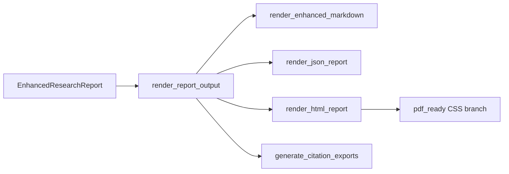

# Output Formats

<!-- canonical: output-formats -->

## Commands

This page is the **canonical reference** for `--format`, `--export`, and the rendering pipeline.

Copy-paste format commands: [README Output Format](https://github.com/Ndevu12/Research_Assistant_Model#output-format). CLI flags: [CLI reference](cli.md).

## Rendering pipeline

All CLI, interactive, and API paths converge on a single dispatcher:



Source: `src/reporting/output.py`

```python
def render_report_output(report, *, output_format="markdown", partial=False, warnings=None, export_formats=None):
    fmt = output_format.lower()
    if fmt == "json":
        return render_json_report(report, partial=partial, warnings=warnings or [])
    if fmt in {"html", "pdf"}:
        return render_html_report(..., pdf_ready=(fmt == "pdf"))
    return render_enhanced_markdown(report, partial=partial, warnings=warnings, ...)
```

`export_formats` is accepted by the dispatcher signature but **citation exports are handled separately** in `run_research_helper()` and `InteractiveResearchSession._render_and_persist()` — they append export blocks after the main report rather than embedding them in markdown/HTML.

## Format reference

| `--format` | Renderer module | Output | Notes |
|------------|-----------------|--------|-------|
| `markdown` | `reporting/markdown.py` | stdout (default) | Thematic sections, clusters, synthesis, gaps |
| `json` | `reporting/json_report.py` | stdout or `--output` | Pydantic dump + `meta` block |
| `html` | `reporting/html.py` | file recommended | Standalone HTML with embedded CSS |
| `pdf` | `reporting/html.py` (`pdf_ready=True`) | file recommended | Print-ready HTML — **not** binary PDF |

!!! info "PDF format"
    `--format pdf` saves HTML optimized for printing. Open in a browser → **Print → Save as PDF**. The CLI prints a reminder when writing pdf output.

### Markdown structure

`render_enhanced_markdown()` builds these sections in order:

1. **Pipeline notice** — when `partial=True` or `warnings` non-empty
2. **Query** and **Executive summary**
3. **Thematic findings** — one `## Theme N:` per cluster with linked papers
4. **Paper analyses** — per-paper key points, methodology, limitations
5. **Cross-paper synthesis** — agreements, disagreements, methodologies (when synthesis ran)
6. **Research gaps** — from `gap_analysis`
7. **Bibliography** — citation keys from `citation_index`

Partial runs include warning banners at the top. Heuristic synthesis may show placeholder text when LLM stages were off.

### JSON structure

`report_to_dict()` wraps the pydantic model:

```json
{
  "query": "...",
  "executive_summary": "...",
  "papers": [...],
  "clusters": [...],
  "synthesis": {...},
  "gap_analysis": {...},
  "citation_index": {...},
  "meta": {
    "partial": false,
    "warnings": [],
    "paper_count": 12,
    "cluster_count": 3
  }
}
```

Use JSON for downstream tooling, dashboards, or API integration. The API returns this structure in the `report` field plus a stringified copy in `rendered` when `format=json`.

### HTML / PDF-ready

`render_html_report()` produces a self-contained HTML document:

- Semantic sections mirror markdown content
- Embedded CSS for screen reading
- When `pdf_ready=True`, adds `@media print` rules for page breaks and typography

Always use `--output` for HTML/PDF — printing large HTML to the terminal triggers a tip message from `run_research_helper()`.

## Citation exports (`--export`)

Independent of `--format`. Supported values:

| Format | Module | Description |
|--------|--------|-------------|
| `bibtex` | `src/export/` | BibTeX entries |
| `apa` | `src/export/` | APA 7th-style references |
| `mla` | `src/export/` | MLA-style references |
| `chicago` | `src/export/` | Chicago-style references |

See [CLI reference — Examples](cli.md#examples) for `--export` usage. Supported values: `bibtex`, `apa`, `mla`, `chicago`.

**Batch CLI flow** (`run_research_helper`):

1. Render main report via `render_report_output()`
2. Write to `--output` if set, else print
3. Extract ranked papers from pipeline artifacts
4. Call `generate_citation_exports()` and print each format block after the report

The pipeline also runs `CitationExportStage` internally for bibliography integration in the report body.

**Interactive follow-up:** `export bibtex,apa` re-exports from cached ranked papers without re-retrieval.

## Partial and warning metadata

All renderers accept `partial` and `warnings` from `ResearchPipelineResult`:

| Renderer | Behavior |
|----------|----------|
| Markdown | Notice section at top with warning list |
| HTML | `<section class='notice'>` block |
| JSON | `meta.partial` and `meta.warnings` |

Check stderr progress for ⚠ stage icons when output looks incomplete.

## File output

Use `--output` / `-o` with `--format html` or `--format pdf`. See [CLI reference — Examples](cli.md#examples) and [README Output Format](https://github.com/Ndevu12/Research_Assistant_Model#output-format).

`run_research_helper()` creates parent directories automatically (`path.parent.mkdir(parents=True)`).

Interactive mode always prints to stdout — there is no `--output` in the session loop.

## API rendering

FastAPI `POST /research` calls the same `render_report_output()`:

| Request `format` | `rendered` field type |
|------------------|----------------------|
| `markdown` | string |
| `html` | string |
| `json` | string (JSON text) |

The API does not support `pdf` format. The `export` request field is passed to `render_report_output()` but exports are primarily handled via the separate citation pipeline stage — see [API endpoints](../api/endpoints.md).

## Entry point differences

| Path | Who calls `render_report_output` | Export handling |
|------|----------------------------------|-----------------|
| CLI batch | `run_research_helper()` | Separate print after report |
| Interactive full query | `InteractiveResearchSession._render_and_persist()` | Same as batch |
| Interactive follow-up | `_render_local_report()` | `export …` command only |
| API | `app.py` route handler | Request `export` field |

See [CLI vs API](cli-vs-api.md) for when each path runs.

See also: [CLI reference](cli.md), [Report generation stage](../architecture/stages/report-generation.md), [Citation export stage](../architecture/stages/citation-export.md).
